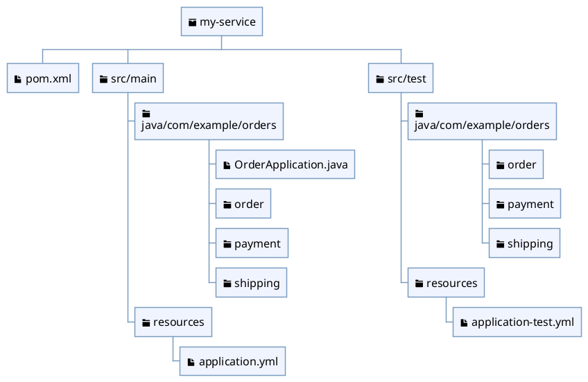

# Folder Structure

## Why this file exists

Folder structure là cách codebase Java nói cho người đọc biết đâu là production code, test code, resource, build config, và boundary chính của project.

Nếu folder structure lẫn lộn, package naming và dependency direction phía sau cũng thường rối theo.

## Rules

- Theo layout chuẩn của build tool trước khi tự nghĩ layout riêng.
- Với Maven hoặc Gradle Java project, production code nên nằm dưới `src/main/java`.
- Test code nên nằm dưới `src/test/java`, không trộn chung với production code.
- Resource nên tách khỏi Java source: `src/main/resources` và `src/test/resources`.
- Package folder phải khớp với package declaration trong file `.java`.
- Chỉ tạo top-level folder mới khi nó đại diện cho một module, application, library, hoặc concern thật sự rõ.
- Tránh folder mơ hồ như `misc`, `temp`, `new`, `common` nếu bên trong không có boundary rõ.

## Standard Java project shape



```text
my-service/
  pom.xml
  src/
    main/
      java/
        com/example/orders/
          OrderApplication.java
          order/
          payment/
          shipping/
      resources/
        application.yml
    test/
      java/
        com/example/orders/
          order/
          payment/
      resources/
        application-test.yml
```

Với Gradle, ý tưởng vẫn giống nhau dù file build có thể là `build.gradle` hoặc `build.gradle.kts`.

## Layout decision matrix

| Situation | Prefer | Why |
|---|---|---|
| Maven/Gradle app thông thường | `src/main/java`, `src/test/java` | Tooling hiểu source set chuẩn |
| Spring Boot service lớn | package theo domain/feature bên dưới root package | Dễ giới hạn dependency và tìm business code |
| Library nhỏ | package theo public API surface | Người dùng library nhìn thấy API rõ hơn |
| Generated code | generated source set riêng nếu build tool hỗ trợ | Tránh trộn code sinh ra với code maintain bằng tay |
| Integration tests lớn | source set hoặc folder test riêng theo project convention | Tách lifecycle test chậm khỏi unit test |

## Good examples

- `src/main/java/com/example/orders/order/`
- `src/main/java/com/example/orders/payment/`
- `src/test/java/com/example/orders/order/`
- `src/main/resources/db/migration/`

Các folder này nói rõ code thuộc source set nào và thuộc business area nào.

PlantUML ở trên hữu ích khi cần nhìn nhanh source set nào chứa production code, test code, và resource mà không phải đọc cây thư mục dài bằng mắt.

## Bad examples

- `src/main/java/com/example/stuff/`
- `src/main/java/com/example/temp/`
- `src/main/java/com/example/utils/` chứa mọi thứ không biết đặt đâu
- `src/main/java/com/example/controller/`, `service/`, `repository/` cho toàn bộ app lớn mà không chia domain
- đặt test helper trong `src/main/java` chỉ để test dùng được

Những layout này làm boundary mờ dần: người đọc phải mở file mới biết code thuộc trách nhiệm nào.

## Notes

Folder structure nên phản ánh cách project được build, test, deploy, và maintain. Nó không chỉ là cách sắp xếp file cho đẹp.

Trong project nhỏ, package theo technical layer có thể đủ. Khi domain lớn dần, chia theo feature hoặc domain thường giúp code dễ tìm và dễ giới hạn dependency hơn.

## Official references

- [Maven Standard Directory Layout](https://maven.apache.org/guides/introduction/introduction-to-the-standard-directory-layout.html)
- [Gradle Java Plugin: Project layout](https://docs.gradle.org/current/userguide/java_plugin.html#sec:java_project_layout)
- [Spring Boot: Structuring Your Code](https://docs.spring.io/spring-boot/docs/current/reference/html/using.html#using.structuring-your-code)

## Related rules

[[002-module-and-package-boundaries]]

[[003-package-naming]]

[[011-code-organization]]
