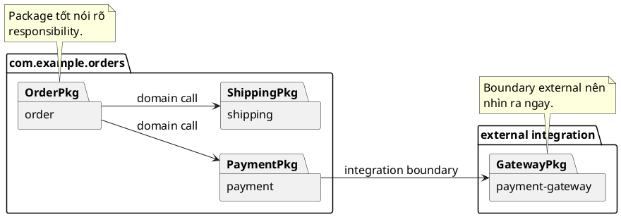

# Module and Package Boundaries

## Why this file exists

Nhiều codebase Java không rối vì syntax, mà rối vì boundary không rõ: package nào chịu trách nhiệm gì, class nào được quyền biết class nào.

## Rules

- Một package nên đại diện cho một nhóm trách nhiệm rõ ràng.
- Ưu tiên group theo domain hoặc feature trước, sau đó mới group theo technical type nếu cần.
- Tránh package quá rộng kiểu `util`, `common`, `manager`, `helper` nếu không nói rõ purpose.
- Nếu một package bắt đầu chứa nhiều concept khác nhau, tách subpackage thay vì để flat mãi.
- Package boundary nên giúp người đọc đoán được class thuộc layer nào trước khi mở file.

## Good examples



```text
com.example.orders.order
com.example.orders.payment
com.example.orders.shipping
```

Chỉ nhìn package đã đoán được business area hoặc responsibility chính.

## Bad examples

```text
com.example.orders.misc
com.example.orders.utils
com.example.orders.temp
```

Các tên này không cho biết boundary thực sự là gì.

## Boundary checklist

- Package này có một chủ đề chính không?
- Người mới nhìn tên package có đoán được vai trò không?
- Có class nào đang nằm sai package chỉ vì “ngại tạo folder mới” không?
- Tên package phản ánh domain hay chỉ phản ánh implementation tạm thời?

## Boundary decision matrix

| Problem | Prefer | Why |
|---|---|---|
| Package chứa nhiều business areas | tách theo domain/feature | Reader tìm code theo nghiệp vụ |
| Package chỉ có `controller`, `service`, `repository` cho app lớn | group theo feature trước, layer sau | Tránh layer package phình to toàn hệ thống |
| Hai package import vòng nhau | trích contract/shared type xuống package thấp hơn | Dependency direction rõ hơn |
| Một interface là boundary với external system | đặt gần domain/integration owner | Caller thấy capability, không thấy implementation |
| Helper dùng duy nhất trong một package | để package-private gần nơi dùng | Tránh tạo `common` giả tạo |

## Notes

Một package boundary tốt có thể giải thích dependency direction bằng một câu. Nếu phải mở nhiều file mới hiểu package nào được quyền gọi package nào, boundary đang yếu.

Sơ đồ trên giúp nhìn dependency direction trước khi đi vào từng class.

## Official references

- [JLS: Packages and Modules](https://docs.oracle.com/javase/specs/jls/se21/html/jls-7.html)
- [Spring Boot: Structuring Your Code](https://docs.spring.io/spring-boot/docs/current/reference/html/using.html#using.structuring-your-code)

## Related rules

[[001-folder-structure]]

[[003-package-naming]]

[[011-code-organization]]