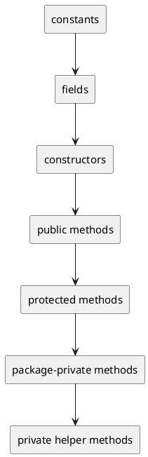

# Code Organization

## Why this file exists

Ngay cả khi naming tốt, một file Java vẫn có thể khó đọc nếu thành phần bên trong bị sắp xếp lộn xộn.

## Recommended order inside a class

1. constants
2. fields
3. constructors
4. public methods
5. protected methods
6. package-private methods
7. private helper methods

## Rules

- Đặt public API trước helper logic.
- Group các method liên quan gần nhau.
- Tránh nhảy qua lại giữa public và private method vô tổ chức.
- Helper method nên nằm dưới method dùng nó nếu điều đó giúp đọc top-down tốt hơn.
- Class quá dài thường là tín hiệu cần tách responsibility.

## Good signs

- Người đọc hiểu class từ trên xuống.
- Tên field, constructor, và public methods kể được “câu chuyện” của class.
- Private helper không lấn át main API.

PlantUML ở trên diễn tả reading flow top-down: người đọc nên thấy public contract trước khi phải lội xuống helper logic.

## Bad signs

- 300 dòng private helper trước public API đầu tiên.
- constants, fields, constructors, methods xen kẽ ngẫu nhiên.
- method A gọi method B nhưng B nằm cách quá xa chỉ vì không có tổ chức.

## Organization decision matrix

| Symptom | Likely issue | Better direction |
|---|---|---|
| Class dài nhưng chỉ có một responsibility | group methods theo story | Giữ class, cải thiện reading flow |
| Class dài vì nhiều responsibility | split class | Boundary quan trọng hơn ordering |
| Private helpers áp đảo public API | move helper xuống hoặc extract collaborator | Public contract phải dễ thấy |
| Many static helpers unrelated | create domain-specific utility or move near owner | Tránh `Util` phình to |
| Constructor quá nhiều dependency | class có thể đang làm quá nhiều | Review responsibility trước khi thêm field |

## Official references

- [Java Code Conventions: File Organization](https://www.oracle.com/java/technologies/javase/codeconventions-fileorganization.html)
- [JLS: Class Body and Member Declarations](https://docs.oracle.com/javase/specs/jls/se21/html/jls-8.html#jls-8.1.7)

## Related rules

[[005-class-naming]]

[[008-method-naming]]