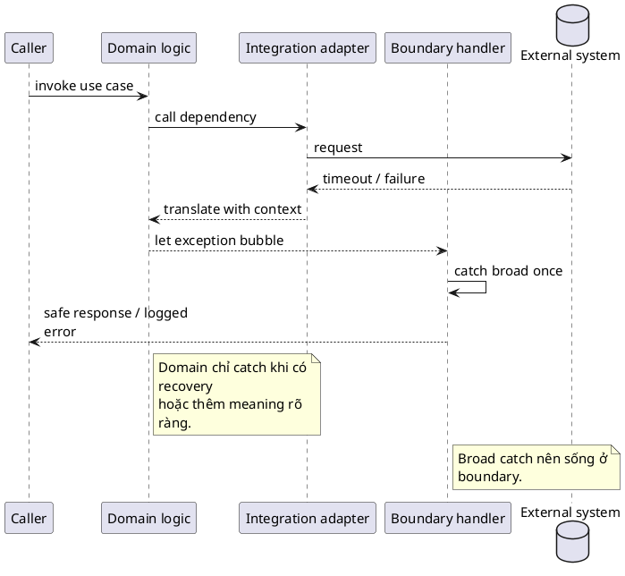

# Exception Handling Guidelines

## Why this file exists

Java code rất dễ trở nên noisy hoặc mơ hồ nếu exception handling không có rule rõ ràng.

## Rules

- Chỉ catch exception khi thật sự biết xử lý gì tiếp theo.
- Không nuốt exception im lặng.
- Message của exception nên mô tả business/context, không chỉ lặp lại type.
- Ưu tiên unchecked exception cho programming error và invalid state trong app/service code hiện đại.
- Dùng checked exception khi caller thật sự có recovery path rõ ràng và API muốn buộc caller xử lý condition đó.

## Good examples

```java
throw new IllegalArgumentException("email must not be blank");
throw new IllegalStateException("payment has already been captured");
```

## Bad examples

```java
catch (Exception e) {
}

throw new RuntimeException("error");
```

## Handling decision matrix

| Situation | Prefer | Avoid |
|---|---|---|
| Invalid argument from caller | `IllegalArgumentException` with clear message | generic `RuntimeException` |
| Invalid object state | `IllegalStateException` or domain exception | silent fallback |
| External system failure | translate/wrap with context | losing root cause |
| Recoverable API contract for library caller | checked exception can be valid | forcing checked exceptions for programming errors |
| Boundary handler | catch broad, log once, return safe response | broad catch deep inside domain logic |
| Cleanup resource | try-with-resources | finally blocks that hide original error |

## Boundary rule

Broad catches nên nằm ở các boundary như: controller advice, CLI entry point, worker loop, scheduler boundary hoặc integration adapter. Domain logic chỉ nên catch các exception cụ thể khi nó thật sự có thể bổ sung thêm ngữ nghĩa hoặc recover được tình huống đó.



## Nuance

Checked exception không “cũ” hay “sai” theo nghĩa tuyệt đối. Nó kém hợp khi chỉ ép caller wrap/rethrow mà không recover được gì. Nhưng trong library API, file/network operation, parser, hoặc workflow mà caller có lựa chọn xử lý thật, checked exception có thể làm contract rõ hơn unchecked exception.

Ngược lại, unchecked exception không nên trở thành nơi giấu mọi lỗi. Nếu exception vượt qua boundary, hãy wrap hoặc translate với context đủ để caller/log hiểu operation nào thất bại và root cause vẫn còn giữ được.

## Naming

- Custom exception nên kết thúc bằng `Exception`.
- Tên nên phản ánh condition, ví dụ `DuplicateEmailException`.

## Official references

- [Java Tutorials: Exceptions](https://docs.oracle.com/javase/tutorial/essential/exceptions/)
- [JLS: Exceptions](https://docs.oracle.com/javase/specs/jls/se21/html/jls-11.html)
- [Spring Framework: Exception handling](https://docs.spring.io/spring-framework/reference/web/webmvc/mvc-controller/ann-exceptionhandler.html)

## Related rules

[[014-logging-guidelines]]

[[016-common-java-anti-patterns]]
