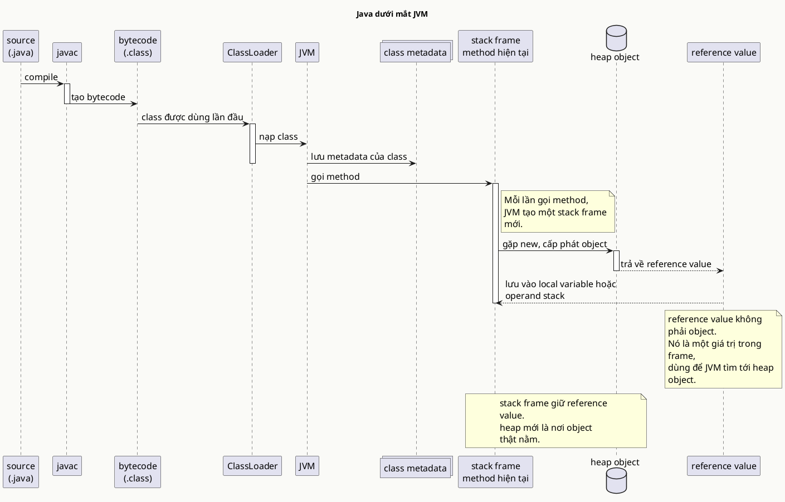
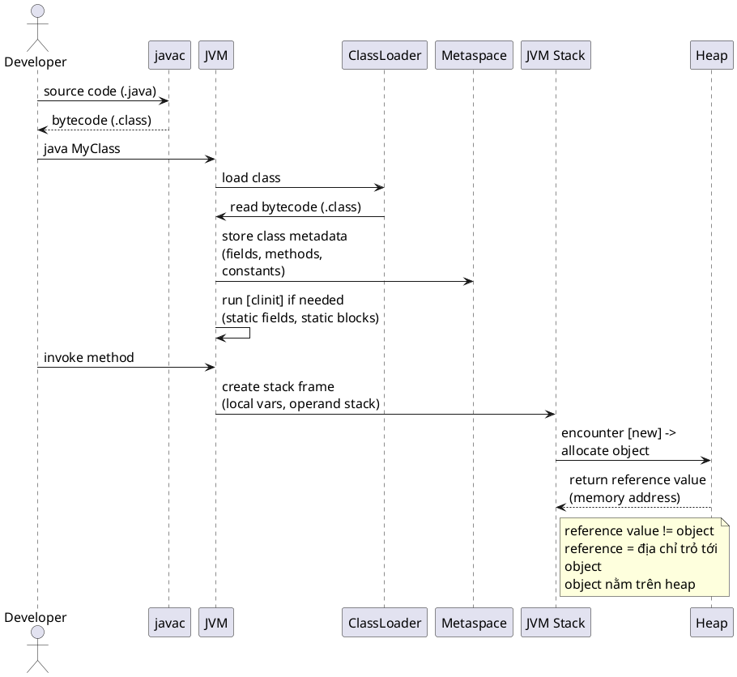
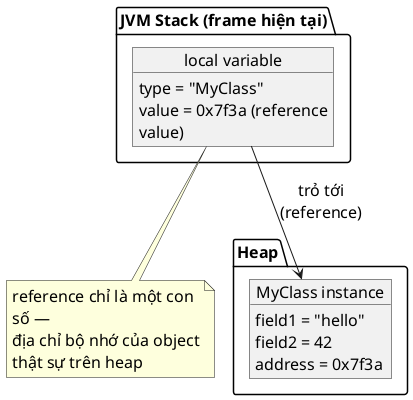

# Java in JVM eyes

## What is it

Khi nhìn bằng mắt của JVM, Java không còn là những dòng source code kiểu “biến này gọi hàm kia” nữa. JVM quan tâm tới `bytecode`, `class metadata`, `stack frame`, `heap object`, và `reference value` nối các phần đó lại.

Điểm mấu chốt là JVM không chạy file `.java`. Nó chạy model runtime đã được chuẩn hóa sau khi compile. Giống như shipper không đọc đoạn chat gốc của bạn, họ chỉ nhìn địa chỉ đã được chuẩn hóa để giao hàng.



## How I used to misunderstand it

Hiểu nhầm phổ biến nhất là JVM “đọc code Java rồi chạy từng dòng”. Sai ở chỗ source code chỉ là đầu vào cho `javac`; đến runtime, JVM chủ yếu thấy `.class`, constant pool, metadata, instruction, và object graph.

Mình cũng từng dễ hiểu nhầm `User user = new User()` là biến `user` chứa nguyên object. Thực tế, local variable chỉ giữ `reference value`, còn object thường được cấp phát trên `heap`.

Thêm một hiểu nhầm nữa là method return thì “mọi thứ bên trong chết hết”. Đúng hơn là `stack frame` biến mất, còn object chỉ biến mất khi không còn reachable reference nào giữ nó nữa.

## How it actually works

Flow thật nên đọc thành từng bước nhỏ:

- `javac` biến source thành `bytecode`.
- `ClassLoader` nạp class vào JVM.
- JVM giữ metadata của class ở vùng quản lý class.
- Khi gọi method, JVM tạo `stack frame`.
- Khi gặp `new`, JVM cấp phát object và trả về một `reference value` cho frame hiện tại.



Ở đây cần nói rất rõ về chữ `reference`.



Trong Java language và JVM spec, reference là một giá trị tham chiếu trừu tượng. Nó không nhất thiết là một machine pointer literal giống cách mình hay tưởng tượng khi học C. JVM implementation có thể biểu diễn reference theo cách riêng, miễn là runtime behavior đúng.

Nói ngắn gọn, takeaway chính là: code Java không cầm object trực tiếp, mà cầm một giá trị dùng để đi tới object.

Thiết kế này tồn tại vì JVM cần một runtime model portable. Cùng một `bytecode` có thể chạy trên Windows, Linux, hay container mà không cần compile lại theo CPU cụ thể. Đó là phần thực tế đằng sau câu “write once, run anywhere”.

Analogies vẫn hữu ích nếu chốt đúng ý. Hãy xem `stack frame` như bàn làm việc tạm của method đang chạy, còn `heap` là kho đồ dùng chung lâu hơn. Takeaway chính không phải chỉ là “bàn với kho”, mà là lifetime khác nhau: frame sống theo method call, object sống theo reachability.

## Code example

```java
class User {
    String name;

    User(String name) {
        this.name = name;
    }
}

public class Main {
    static User createUser() {
        // local variable holds only a reference, so the object can outlive this frame
        User user = new User("Linh");
        // returning the reference proves the heap object is independent from this method's stack frame
        return user;
    }

    public static void main(String[] args) {
        // a new frame is created, then destroyed, but the object stays reachable here
        User first = createUser();
        // copying a reference shows Java passes around the same reference value, not object copies
        User second = first;
        // mutating through one reference affects the same heap object seen by the other
        second.name = "An";
        // prints "An", which is why aliasing matters more than syntax here
        System.out.println(first.name);
    }
}
```

Nếu nhìn ví dụ bằng mắt JVM, `first` và `second` không phải hai object. Chúng là hai local variables đang giữ đường đi tới cùng một heap object.

## When to use / when NOT to use

Dùng mental model này khi debug `NullPointerException`, memory leak, bean lifecycle, object sharing, hoặc pass-by-value của reference. Nếu một service sửa object rồi object ở chỗ khác cũng đổi theo, đây là model giúp bạn hiểu nhanh vì sao.

Không cần bật mode này khi chỉ đang nhớ syntax `switch`, viết DTO rất đơn giản, hoặc dùng API level cao như `Stream` theo nhu cầu hằng ngày. Lúc đó model này có thể sâu hơn mức cần thiết.

## How this connects to Spring

Spring Boot chạy trên đúng runtime model này: bean là object trên `heap`, container giữ reference tới chúng, và nhiều bean thật ra là proxy class được tạo thêm rồi nạp bởi class loading mechanism.

Đó là lý do khi bạn bật `@Transactional`, code trông như gọi method bình thường nhưng JVM thực tế có thể đang đi qua một object proxy khác bọc bên ngoài. Nếu không có mental model reference và object identity, chỗ này rất dễ thấy “ma thuật”.

## Gotchas

- `final` trên reference không làm object immutable; nó chỉ chặn việc gán reference đó sang object khác.
- Gán object vào collection static hoặc cache sống lâu có thể giữ reference rất lâu, khiến GC chưa thể thu hồi object.
- Truyền object vào method vẫn là pass-by-value; cái được copy là `reference value`, không phải whole object.
- Đừng dạy bản thân rằng reference Java chắc chắn là “con trỏ bộ nhớ thô”. Cách nói đó dễ hiểu nhanh, nhưng không chính xác về mặt model.

## Check yourself

- JVM chạy trực tiếp `.java` hay chạy `bytecode`?
- Trong `User user = new User()`, local variable `user` giữ gì?
- Khi method return, phần nào biến mất ngay, `stack frame` hay heap object?
- Vì sao hai biến khác nhau vẫn có thể nhìn thấy cùng một thay đổi trên object?
- Tại sao nói reference trong Java là abstract reference value lại đúng hơn nói “đó là machine pointer”? 

## Links

- [[005-jvm-load-class]]
- [[003-stack-vs-heap]]
- [[004-pass-by-value]]
- [[011-value-type-vs-reference-type]]
- [JVMS Chapter 2, The Structure of the Java Virtual Machine](https://docs.oracle.com/javase/specs/jvms/se21/html/jvms-2.html)
- [JLS Chapter 4, Types, Values, and Variables](https://docs.oracle.com/javase/specs/jls/se21/html/jls-4.html)
