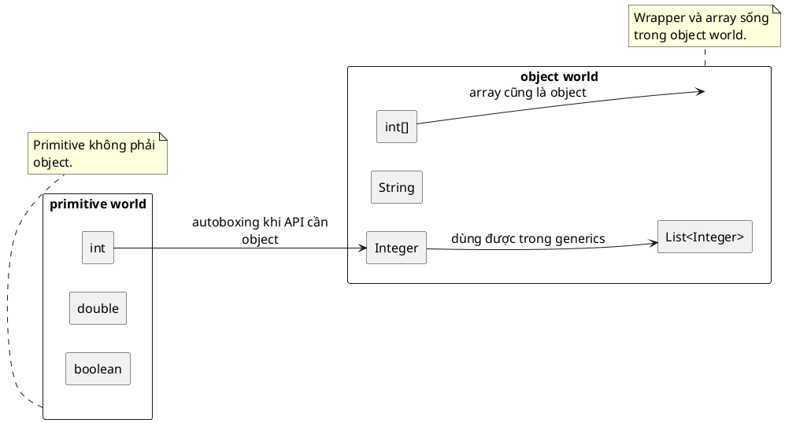

# Everything is object

## What is it

Trong Java, câu đúng không phải là “mọi thứ đều là object”. Câu đúng hơn là: “Java được thiết kế theo hướng object-centric”.

Nghĩa là phần lớn thứ bạn model trong code, như `String`, `List`, `Exception`, bean trong Spring, đều là object. Nhưng vẫn có `primitive` như `int`, `double`, `boolean`, chúng không phải object.

Một cách nhớ dễ hơn là: Java ưu tiên object để code nhất quán hơn, nhưng vẫn giữ `primitive` để runtime nhanh và gọn hơn.

## How I used to misunderstand it

Hiểu nhầm phổ biến nhất là thấy Java là OOP nên kết luận `int` cũng là object. Không đúng. `int` chỉ là primitive value, không có method instance, không có identity như `Integer`.

Hiểu nhầm thứ hai là cứ chỗ nào Java cho gọi API “giống object” thì bên dưới chắc cũng là object. Ví dụ khi thêm `1` vào `List<Integer>`, nhiều người tưởng số `1` vốn là object. Thật ra Java đã `autobox` nó thành `Integer` để khớp với API cần reference type.

## How it actually works

Java được thiết kế quanh object vì object gom `state` và `behavior` vào một đơn vị dễ truyền, dễ mở rộng, dễ áp dụng polymorphism. Nhưng nếu mọi giá trị cơ bản đều là object, runtime sẽ phải cấp phát quá nhiều object nhỏ, tốn memory và tăng áp lực cho GC.



Vì vậy Java tách ra ba thứ mà người mới rất hay trộn lẫn lần lượt là Primitive, Wrapper, Regular object:

| Kind           | Ví dụ                          | Có phải object không | Có thể là `null` không | Có method instance không   | Ghi chú                                                               |
| -------------- | ------------------------------ | -------------------- | ---------------------- | -------------------------- | --------------------------------------------------------------------- |
| Primitive      | `int`, `double`, `boolean`     | Không                | Không                  | Không                      | Nhẹ, fixed-size, hợp cho tính toán                                    |
| Wrapper        | `Integer`, `Double`, `Boolean` | Có                   | Có                     | Có                         | Primitive được “bọc” thành object để dùng trong object world của Java |
| Regular object | `String`, `User`, `List`       | Có                   | Có                     | Có                         | Sống trong object world của Java                                      |
| Array          | `int[]`, `String[]`            | Có                   | Có                     | Kế thừa method từ `Object` | Array là object đặc biệt chứa nhiều phần tử fixed-size                |

`Wrapper` như `Integer`, `Long`, `Boolean` là cầu nối giữa primitive world và object world. Chúng tồn tại vì nhiều API của Java cần object, đặc biệt là `Collections`, `Generics`, reflection, và framework layer như Spring data binding.

Đây là lý do `List<int>` không hợp lệ nhưng `List<Integer>` thì hợp lệ. Generic của Java làm việc với reference type, không làm việc trực tiếp với primitive.

`Autoboxing` được thêm vào để bạn không phải viết `Integer.valueOf(1)` khắp nơi. Nhưng nó chỉ là tiện lợi cú pháp. Nó không xoá khác biệt bản chất giữa primitive và object.

Một chi tiết dễ quên là array cũng là object. `int[]` không phải primitive, dù nó chứa primitive. Bạn có thể gán `int[] numbers = new int[3];` cho biến reference, truyền nó vào method như object, và mutate phần tử bên trong.

## Code example

```java
import java.util.ArrayList;
import java.util.Arrays;
import java.util.List;

public class Main {
    public static void main(String[] args) {
        // primitive value
        int primitive = 1;
        // autoboxing creates an Integer object
        Integer wrapper = primitive;

        List<Integer> numbers = new ArrayList<>();
        // primitive is boxed because List works with reference types
        numbers.add(primitive);

        // wrapper is unboxed here
        int sum = primitive + wrapper;
        System.out.println(sum);

        int[] scores = {10, 20};
        // arrays are objects in Java
        Object asObject = scores;
        // arrays are still mutable
        scores[0] = 99;

        System.out.println(wrapper.equals(1));
        System.out.println(Arrays.toString((int[]) asObject));
    }
}
```

## When to use / when NOT to use

Dùng mental model này khi thiết kế domain model, đọc generic API, xử lý `null`, tối ưu performance, hoặc debug bug liên quan `Integer` và `int`.

Ví dụ, nếu field có thể thiếu giá trị trong request thì `Integer` hợp lý hơn `int` vì nó biểu diễn được `null`. Nếu bạn xử lý dữ liệu số lượng lớn trong loop nóng, primitive thường hợp lý hơn vì tránh boxing và giảm allocation.

Không nên lạm dụng model này khi chỉ cần code business logic đơn giản. Lúc đó chỉ cần nhớ quy tắc thực dụng: cần `null`, generic, collection, reflection thì dùng wrapper, còn cần hiệu năng và luôn có giá trị thì ưu tiên primitive.

## How this connects to Spring

Trong Spring Boot, khác biệt giữa `int` và `Integer` xuất hiện rất rõ ở data binding và validation. Nếu request thiếu một field, `Integer` có thể nhận `null`, còn `int` thì không. Cùng một DTO nhưng hành vi có thể khác hẳn chỉ vì chọn primitive hay wrapper.

Spring cũng dựa mạnh vào reflection và generic metadata, nên ở rìa framework, object world gần như là mặc định. Đó là lý do wrapper và object type xuất hiện rất nhiều ở controller, DTO, repository API.

## Gotchas

- `Integer x = null; int y = x;` sẽ ném `NullPointerException` vì unboxing cần một giá trị thật.
- `==` với wrapper dễ gây hiểu nhầm vì có lúc so identity giữa object, có lúc bị unbox sang value comparison tuỳ ngữ cảnh.
- Dùng quá nhiều wrapper trong loop nóng hoặc collection lớn có thể tạo nhiều allocation không cần thiết.
- Array là object, nhưng không phải immutable object. `final int[] arr` vẫn cho phép `arr[0] = 42`.

## Check yourself

- Vì sao `List<int>` không hợp lệ nhưng `List<Integer>` lại hợp lệ?
- `int[]` là primitive hay object?
- `Integer` khác `int` ở những điểm nào liên quan tới `null`, method, và allocation?
- Khi nào nên chọn wrapper dù biết nó nặng hơn primitive?

## Links

[[../01_Core/Types-and-Variables/001-Primitive-vs-Wrapper]]
[[011-value-type-vs-reference-type]]
- JLS Chapter 4, Types, Values, and Variables: https://docs.oracle.com/javase/specs/jls/se21/html/jls-4.html