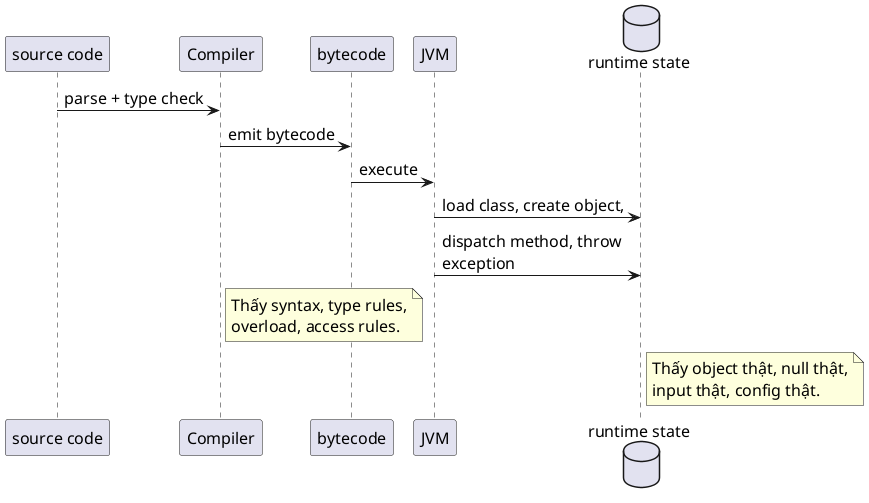
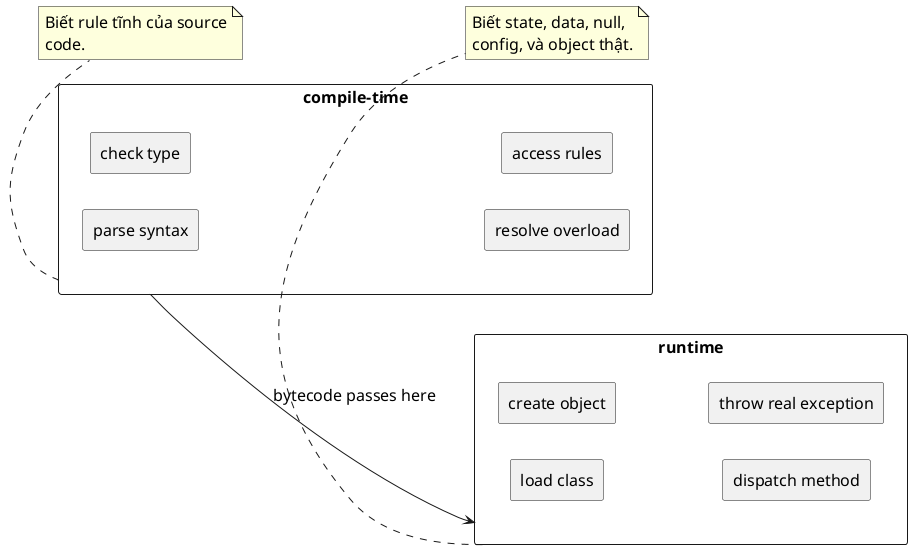

# Compile time vs Runtime

## What is it

`Compile-time` là lúc source code được compiler kiểm tra và biến thành `bytecode`; `runtime` là lúc `bytecode` đó thực sự chạy trong JVM. Điểm quan trọng không phải chỉ là “trước và sau khi chạy”, mà là mỗi giai đoạn biết những thứ khác nhau.

Compiler chỉ thấy source, type information, và rule của ngôn ngữ. Runtime mới thấy object thật, `null` thật, class nào được load, config nào được inject, và dữ liệu nào thực sự đi vào chương trình.

## How I used to misunderstand it

Hiểu nhầm phổ biến nhất là: “compile được thì gần như đúng rồi”. Sai, vì compiler chỉ chứng minh code hợp lệ theo luật tĩnh, không chứng minh chương trình sẽ chạy đúng với dữ liệu thật.

Hiểu nhầm thứ hai là tưởng runtime chỉ đơn giản là execute code đã được chốt hết từ trước. Thực ra rất nhiều thứ chỉ được quyết định ở runtime: object nào được tạo, method implementation nào được dispatch, class nào được initialize, bean nào được instantiate, và exception nào thực sự nổ.

## How it actually works



Ở `compile-time`, Java compiler làm các việc như parse syntax, check type, resolve overload, áp dụng access rules, và đôi khi tối ưu nhỏ như constant folding. Ví dụ, compiler có thể chặn `String s = 10;` ngay vì type mismatch là thứ nó thấy rõ từ source.



Nhưng compiler không thể biết một biến object có đang là `null` ở đúng nhánh runtime hay không, file config có tồn tại không, hay request input thực tế có giá trị gì.

Ở `runtime`, JVM mới load class, tạo object, cấp phát memory, chạy method body, dispatch method thật sự, và ném exception khi trạng thái thực tế vi phạm giả định của code.

Đây là bảng ngắn gọn rất hay dùng khi debug:

| Compile-time catches | Runtime catches |
| --- | --- |
| Syntax error | `NullPointerException` |
| Type mismatch rõ ràng | `ClassCastException` khi cast sai thật sự xảy ra |
| Sai số lượng tham số | Lỗi config, missing file, bad input |
| Access rule vi phạm | `ArithmeticException`, logic branch sai với data thật |
| Một số warning tĩnh | Bean wiring, proxy behavior, reflection issues |

Java tách hai giai đoạn này để vừa có safety sớm từ type system, vừa giữ được tính linh hoạt của runtime như polymorphism, reflection, dynamic loading, và framework-driven behavior.

Analogy nếu cần là: compiler giống người duyệt bản vẽ, runtime giống công trường thật. Nhưng takeaway chính phải là “hai giai đoạn sở hữu thông tin khác nhau”, không phải “một bên thông minh hơn bên kia”.

## Code example

```java
public class Main {
    public static void main(String[] args) {
        // compiler accepts this because null is allowed for reference types
        String text = null;

        if (args.length > 0) {
            // the real value only exists at runtime, so compile-time cannot reason about it fully
            text = args[0];
        }

        // this compiles, but runtime may throw NullPointerException if no argument was passed
        System.out.println(text.length());
    }
}
```

Điểm đáng nhớ ở ví dụ này là compiler không “ngu” và runtime không “ngẫu nhiên”. Mỗi bên chỉ xử lý phần thông tin mà nó thực sự sở hữu. Compiler thấy method `length()` hợp lệ trên type `String`; runtime mới biết object hiện tại có thật hay đang là `null`.

## When to use / when NOT to use

Dùng mental model này khi debug lỗi kiểu “build xanh nhưng app nổ”, khi làm việc với generics, reflection, annotation processing, config binding, hoặc khi cần biết một check nên đặt ở compiler, validation layer, hay runtime guard.

Ví dụ, nếu một field bắt buộc nhưng dữ liệu đến từ HTTP request, compile-time không cứu được bạn; bạn cần runtime validation.

Không cần bật mode này khi chỉ code logic tuyến tính rất nhỏ không đụng tới input ngoài, framework, hay dynamic behavior.

## How this connects to Spring

Spring Boot là ví dụ điển hình cho sự khác nhau này: code có thể compile hoàn hảo, nhưng app vẫn fail ở runtime vì bean không tạo được, property thiếu, profile khác nhau, hoặc proxy behavior khác mong đợi.

Annotation như `@Autowired`, `@Transactional`, `@ConfigurationProperties` nhìn có vẻ “đã xong ở code”, nhưng hiệu lực thật của chúng chỉ xuất hiện khi Spring container chạy và gắn chúng vào runtime context.

## Gotchas

- Không có compile error không có nghĩa là không có bug; nhiều lỗi quan trọng nhất của Java là runtime state issues.
- Warning của compiler, nhất là với raw type hoặc unchecked cast, thường là dấu hiệu một lỗi runtime đang bị hoãn lại.
- `static final` compile-time constant có thể bị inline, nên thay đổi một chỗ chưa chắc làm runtime behavior đổi nếu code phụ thuộc chưa được recompiled.

## Check yourself

- Compiler biết chắc những gì, và không biết những gì?
- Vì sao `text.length()` có thể compile nhưng vẫn nổ ở runtime?
- Một lỗi thiếu config của Spring thuộc compile-time hay runtime?
- Khi nào warning compile-time là dấu hiệu của bug runtime tương lai?
- Nếu cần chặn dữ liệu HTTP sai định dạng, vì sao bạn không thể chỉ trông vào compiler?

## Links

- [[005-jvm-load-class]]
- [[001-java-in-jvm-eyes]]
- [JLS Chapter 12, Execution](https://docs.oracle.com/javase/specs/jls/se21/html/jls-12.html)
- [JLS Chapter 15, Expressions](https://docs.oracle.com/javase/specs/jls/se21/html/jls-15.html)
