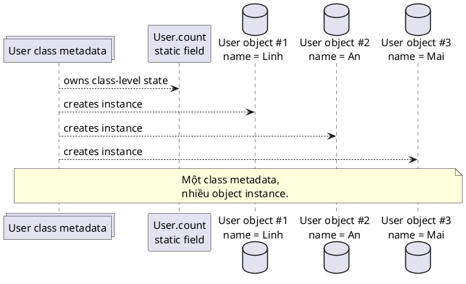
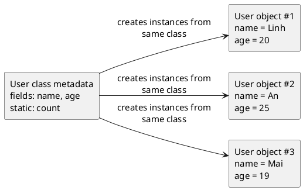

# Class vs Object

## What is it

`Class` là bản thiết kế, còn `object` là instance thật được tạo ra từ bản thiết kế đó. Class mô tả object sẽ có field gì, method gì, rule gì. Object mới là thứ có state cụ thể trong runtime.

Giống như bản vẽ nhà và căn nhà thật: bản vẽ nói nhà có mấy phòng, cửa ở đâu. Mỗi căn nhà xây từ bản vẽ đó lại có màu sơn, đồ đạc, và người ở khác nhau.

## How I used to misunderstand it

Hiểu nhầm phổ biến nhất là class và object chỉ là hai cách gọi cùng một thứ. Không đúng. Bạn có thể có một class `User`, nhưng tạo ra hàng triệu object `User` khác nhau trên heap.

Hiểu nhầm thứ hai là `static` field thuộc từng object. Thật ra nó thuộc về class-level state, nên mọi instance nhìn cùng một giá trị.

Cũng rất dễ nhầm rằng mỗi lần `new User()` là JVM load class lại. Thực tế class thường được load một lần bởi class loader, rồi dùng metadata đó để tạo nhiều object.

## How it actually works



Khi JVM load một class, nó tạo runtime representation cho class đó: metadata về tên class, fields, methods, superclass, interfaces, và một `Class` object mà reflection có thể dùng.



Metadata này là “bản thiết kế runtime”. Khi code gọi `new User(...)`, JVM không tạo lại class definition. Nó cấp phát object mới, gắn object đó với class metadata đã có, rồi chạy constructor để thiết lập state ban đầu.

Điểm quan trọng là class-level và object-level state khác nhau:

- Instance fields như `name` nằm trong từng object, nên mỗi object có giá trị riêng.
- Static fields như `count` gắn với class, nên mọi object cùng thấy và cùng sửa một nơi.

Sketch ngắn để nhớ:

```text
User class metadata
  fields: name, age
  methods: login(), logout()
  static: count
        |
        +--> User object #1 { name = "Linh", age = 20 }
        +--> User object #2 { name = "An", age = 25 }
        +--> User object #3 { name = "Mai", age = 19 }
```

Một class metadata, nhiều object instance. Đó là mental model quan trọng nhất của note này.

## Code example

```java
class User {
    static int count = 0;
    String name;

    User(String name) {
        // instance state belongs to this specific object
        this.name = name;
        // class-level state is shared by all User objects
        count++;
    }
}

public class Main {
    public static void main(String[] args) {
        User first = new User("Linh");
        User second = new User("An");

        System.out.println(first.name); // Linh
        System.out.println(second.name); // An
        System.out.println(User.count); // 2
        System.out.println(first.getClass() == second.getClass()); // true
    }
}
```

Ví dụ này cho thấy `first` và `second` là hai object khác nhau, nhưng chúng cùng dùng một runtime class definition. Đó là lý do instance state tách riêng, còn `static` state thì chung.

## When to use / when NOT to use

Dùng mental model này khi debug bug liên quan `static`, shared state, object creation, reflection, factory method, hoặc khi không hiểu vì sao nhiều object lại ảnh hưởng nhau qua một field chung.

Ví dụ, nếu mỗi request tạo `User` mới nhưng counter tăng chung toàn app, đó là class-level state chứ không phải state riêng của từng user.

Không cần đào sâu model này khi chỉ khai báo class đơn giản lúc mới học syntax. Lúc đó chỉ cần nhớ class là khuôn, object là bản thể cụ thể.

## How this connects to Spring

Trong Spring Boot, component scanning đọc class metadata để biết class nào có annotation như `@Service`, `@Controller`. Nhưng bean mà container quản lý lại là object instance được tạo từ class đó.

Proxy cũng dựa trên ranh giới này. Spring có thể tạo proxy class hoặc proxy object khác đi, nhưng mục tiêu cuối vẫn là kiểm soát object instance được đưa vào dependency graph.

## Gotchas

- `static` field không thuộc từng object, nên dùng nó cho mutable state rất dễ tạo bug shared state.
- `object.getClass()` trả về `Class` object đại diện cho runtime class metadata, không phải “class source file”.
- Class loading và object creation là hai việc khác nhau. `new` nhiều lần không có nghĩa class được load nhiều lần.
- `User.class` và `new User(...)` liên quan với nhau, nhưng không cùng cấp khái niệm. Một bên là type metadata, một bên là runtime instance.

## Check yourself

- `new User("Linh")` tạo ra class mới hay object mới?
- Vì sao `first.getClass() == second.getClass()` lại là `true`?
- `static int count` sống ở level nào?
- Một app có thể có 1 class `User` nhưng 1 triệu object `User` không?

## Links

[[005-jvm-load-class]]
[[008-object-lifecycle]]
