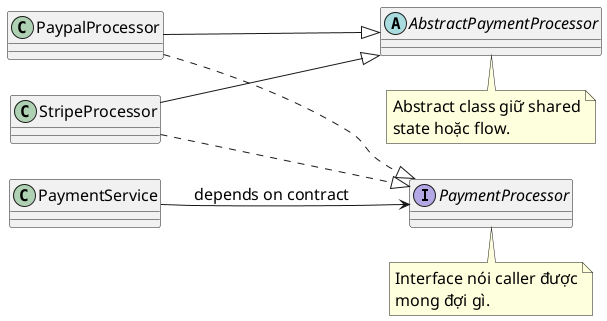

# Interface vs Abstract Class

## What is it

`Interface` mô tả một contract hoặc capability, tức object này làm được gì.
`Abstract class` thường hợp khi nhiều subtype liên quan chặt cần chung state hoặc behavior, tức object này là một loại gì, và các subclass của nó bắt buộc phải chia sẻ điều gì.

Nói ngắn gọn, interface giống ổ cắm chuẩn mà nhiều thiết bị khác nhau có thể cắm vào. Abstract class giống khung xe chung cho nhiều mẫu xe cùng hãng, vừa cho form chung vừa mang một phần implementation sẵn.

Nếu phải nhớ một câu duy nhất, hãy nhớ thế này:

- `interface` trả lời câu hỏi: “bên ngoài được quyền mong đợi gì?”
- `abstract class` trả lời câu hỏi: “các subtype này bắt buộc phải chia sẻ cái gì?”

## How I used to misunderstand it

Hiểu nhầm phổ biến nhất là “abstract class chỉ là interface có thêm code”. Sai, vì abstract class không chỉ thêm code, nó còn kéo theo inheritance relationship, constructor, shared state, visibility như `protected`, và giới hạn single inheritance.

Hiểu nhầm ngược lại cũng rất hay gặp: thấy interface có `default method` rồi kết luận interface giờ thay abstract class được hết. Không đúng. `Default method` hợp cho convenience behavior nhỏ. Khi cần shared state hoặc invariant mạnh cho cả một nhóm subtype, `abstract class` thường rõ hơn.

Một hiểu nhầm khác là chọn abstract class chỉ để reuse vài helper method. Cách đó có thể tiện trước mắt, nhưng về sau class đó mất luôn cơ hội `extend` một base class khác. Khi lý do chính chỉ là reuse code, `composition` thường là lựa chọn ít ràng buộc hơn.

## How it actually works

Một class có thể `implement` nhiều interface. Vì vậy interface rất hợp để mô tả các capability độc lập như `Runnable`, `Comparable`, hoặc `PaymentProcessor`. Caller chỉ cần biết contract, không cần biết implementation cụ thể là gì.



Đó là lý do interface hay xuất hiện ở API boundary, plugin point, test double, và nhiều chỗ trong dependency injection.

Nhưng đừng biến nó thành khẩu hiệu kiểu “hễ DI là phải có interface”. Nếu hệ thống chỉ có đúng một implementation ổn định và chưa có nhu cầu tách contract rõ ràng, một concrete class vẫn có thể là lựa chọn hợp lý.

Abstract class thì khác. Một class chỉ `extend` được một class, nên khi chọn abstract class, bạn đang đưa thiết kế vào một inheritance tree cụ thể. Đổi lại, abstract class có thể giữ shared fields, constructor logic, `protected` helper methods, và template method để ép một algorithm skeleton.

Vì vậy, abstract class hợp khi các subclass thật sự cùng một nhóm subtype liên quan chặt và cần chia sẻ invariant.

Ví dụ: tất cả payment processor trong nhóm này đều phải validate amount trước khi thanh toán. Lúc đó base class giúp bạn giữ flow ở một chỗ, thay vì để từng subclass tự nhớ làm đúng.

Nếu mục tiêu chỉ là “tôi muốn dùng lại logic này”, hãy dừng lại một nhịp và hỏi xem `composition` có đơn giản hơn không. Reuse code không tự động dẫn tới inheritance.

## Code example

```java
interface PaymentProcessor {
    // caller depends on capability, not on one concrete class
    void pay(int amount);
}

abstract class BasePaymentProcessor implements PaymentProcessor {
    protected final String merchantId;

    BasePaymentProcessor(String merchantId) {
        // shared state belongs here only if every subclass truly needs it
        this.merchantId = merchantId;
    }

    @Override
    public final void pay(int amount) {
        // shared algorithm skeleton keeps the invariant in one place
        validate(amount);
        doPay(amount);
    }

    private void validate(int amount) {
        if (amount <= 0) {
            throw new IllegalArgumentException("amount must be positive");
        }
    }

    // subclasses customize the variable step only
    protected abstract void doPay(int amount);
}

class CardPaymentProcessor extends BasePaymentProcessor {
    CardPaymentProcessor(String merchantId) {
        super(merchantId);
    }

    @Override
    protected void doPay(int amount) {
        System.out.println("Card payment: " + amount);
    }
}
```

Ví dụ này cho thấy ba lớp ý nghĩa khác nhau:

- `PaymentProcessor` là contract mà caller nên phụ thuộc vào.
- `BasePaymentProcessor` là implementation scaffold cho một nhóm subtype cụ thể.
- `CardPaymentProcessor` chỉ điền phần khác biệt, không được phá vỡ flow chung.

## When to use / when NOT to use

### Quick decision table

| If your main need is...                   | `interface`                      | `abstract class`              | `composition`                              |
| ----------------------------------------- | -------------------------------- | ----------------------------- | ------------------------------------------ |
| Mô tả contract cho caller                 | Best fit                         | Có thể, nhưng thường nặng tay | Không phải lựa chọn chính                  |
| Nhiều implementation rất khác nhau        | Best fit                         | Thường không hợp              | Thường kết hợp tốt                         |
| Shared state hoặc constructor logic       | Không hợp                        | Best fit                      | Có thể, nhưng phải tách state holder riêng |
| Ép invariant hoặc algorithm skeleton      | Hạn chế với `default method`     | Best fit                      | Có thể, nếu tách flow sang collaborator    |
| Chỉ muốn reuse một ít logic               | Thường không phải mục tiêu chính | Dễ bị lạm dụng                | Best fit                                   |
| Muốn giữ thiết kế linh hoạt, ít ràng buộc | Tốt                              | Kém hơn vì khoá inheritance   | Tốt nhất trong nhiều trường hợp            |

### Practical rule of thumb

Dùng interface khi bạn đang thiết kế API boundary, plugin point, service contract, test double, hoặc capability có thể được nhiều loại object rất khác nhau cung cấp.

Dùng abstract class khi các subclass thật sự cùng một nhóm subtype liên quan chặt và cần shared state, constructor logic, hoặc algorithm skeleton mà mọi subclass đều phải tuân theo.

Dùng composition khi bạn chỉ muốn reuse behavior, phối hợp nhiều collaborator, hoặc tránh cột chặt class vào một inheritance tree.

Không nên dùng abstract class chỉ vì muốn reuse vài method nhỏ. Quyết định đó khoá mất một slot inheritance duy nhất của Java và làm class hierarchy cứng hơn cần thiết.

Không nên tạo interface chỉ để “cho có DI”. Nếu abstraction không đại diện cho một contract có ý nghĩa, bạn chỉ đang thêm một lớp indirection làm code khó đọc hơn.

## How this connects to Spring

Trong Spring Boot, interface thường hợp với dependency injection vì controller hoặc service có thể phụ thuộc vào `PaymentProcessor` thay vì `CardPaymentProcessor`. Cách này giúp thay implementation, mock trong test, hoặc tạo proxy dễ hơn.

Nhưng interface không mặc định đồng nghĩa với DI boundary. Có nhiều Spring bean rất ổn khi bắt đầu bằng concrete class, nhất là khi chưa có nhiều implementation hoặc contract chưa đủ ổn định để trừu tượng hoá.

Abstract class vẫn dùng được trong Spring, nhưng thường nên nằm phía sau implementation detail. Ví dụ, nhiều service adapter cùng chia sẻ validation flow hoặc logging hook có thể cùng `extend` một abstract base.

Tuy nhiên, nếu bạn phụ thuộc trực tiếp vào abstract base ở API boundary hoặc service boundary, code dễ bị dính vào inheritance design thay vì contract thật sự của use case.

## Gotchas

- `default method` trong interface nên dùng cẩn thận. Nếu nó bắt đầu chứa business flow phức tạp, đó là dấu hiệu nên xem lại xem `abstract class` hoặc `composition` có rõ hơn không.
- Abstract class làm inheritance tree cứng hơn vì Java chỉ cho `extend` một class.
- Chia sẻ code không tự động có nghĩa là phải dùng inheritance. Rất nhiều trường hợp, helper object hoặc composition rõ hơn và dễ thay đổi hơn.
- Quá nhiều interface một-method không có ý nghĩa domain rõ ràng sẽ tạo interface explosion và làm code khó đọc hơn.

## Check yourself

- Nếu bỏ toàn bộ shared code đi, abstraction này còn có ý nghĩa contract với caller không. Nếu có, nghiêng về `interface`.
- Nếu mọi subclass đều cần cùng state, cùng constructor rule, và cùng invariant, abstract base có thể hợp lý.
- Nếu lý do chính chỉ là reuse vài method hoặc tránh copy-paste, hãy thử nghĩ theo `composition` trước.
- Nếu ngày mai class này cần `extend` một base class khác, lựa chọn abstract class hôm nay có làm bạn kẹt không.
- Nếu bạn đặt abstraction vào Spring, bạn đang mô tả contract thật hay chỉ thêm indirection vì nghĩ “code sạch thì phải có interface”.

## Links

[[009-Class-vs-Object]]
[[../01_Core/Functional/002-Functional-Interface]]

- Java Language Specification, Interfaces: https://docs.oracle.com/javase/specs/jls/se21/html/jls-9.html
- Java Language Specification, Classes: https://docs.oracle.com/javase/specs/jls/se21/html/jls-8.html
- Oracle Tutorial, Abstract Methods and Classes: https://docs.oracle.com/javase/tutorial/java/IandI/abstract.html