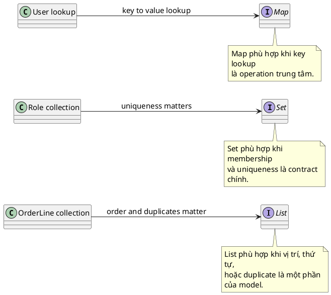

# List vs Set vs Map

## What is it

`List`, `Set`, và `Map` là ba mental model gốc của Java Collections.

- `List` dùng khi vị trí, thứ tự, hoặc duplicates có ý nghĩa.
- `Set` dùng khi điều quan trọng là một phần tử có tồn tại hay không, và mỗi phần tử chỉ nên xuất hiện một lần.
- `Map` dùng khi bạn muốn đi từ `key` tới `value` thật nhanh.

Nếu phải nhớ bằng hình ảnh:

- `List` giống danh sách việc cần làm theo thứ tự.
- `Set` giống danh sách số CCCD, không được trùng.
- `Map` giống danh bạ, biết tên thì tìm ra số điện thoại.

## How I used to misunderstand it

Hiểu nhầm phổ biến nhất là thấy “nhiều item” thì mặc định dùng `List`.

Vấn đề là `List` không nói được rule quan trọng như “không được trùng” hoặc “phải lookup bằng key”. Vì vậy bug thường tới muộn. Lúc đầu code vẫn chạy, nhưng sau đó bạn mới phát hiện duplicate role, duplicate email, hoặc phải scan list liên tục để tìm item theo ID.

Hiểu nhầm thứ hai là xem `Set` như `List` có thêm bước xoá trùng. Thực ra `Set` diễn đạt một contract khác hẳn. Nó nói rằng uniqueness là một phần của mô hình dữ liệu.

`Map` cũng hay bị dùng sai như hai `List` song song, một list key và một list value. Cách đó dễ lệch index, khó đọc, và lookup tệ hơn nhiều.

## How it actually works

`List` là collection theo vị trí. Câu hỏi chính là: phần tử ở index này là gì, hoặc thứ tự xuất hiện là gì.

`Set` là collection theo membership. Câu hỏi chính là: item này đã tồn tại chưa. Tuỳ implementation, uniqueness có thể dựa trên hash, insertion order, hoặc sorted order.

`Map` là cấu trúc key-value. Câu hỏi chính là: với key này, value tương ứng là gì. `Map` không phải chỉ là “nơi chứa value”. Bản chất của nó là quan hệ giữa key và value.

Điểm quan trọng nhất là interface thể hiện rõ dữ liệu được phép như thế nào:



- `List<OrderLine>` nói thứ tự hoặc duplicates có thể có ý nghĩa.
- `Set<Role>` nói role không được trùng.
- `Map<Long, User>` nói lookup theo `id` là trường hợp sử dụng chính.

### Bảng so sánh nhanh

| If your main question is... | Best fit | Why |
|---|---|---|
| “Phần tử thứ 3 là gì?” | `List` | Vị trí là một phần của dữ liệu |
| “Item này đã có chưa?” | `Set` | Membership và uniqueness là trọng tâm |
| “Với key này thì value là gì?” | `Map` | Lookup theo key là operation chính |
| “Tôi cần giữ duplicates” | `List` | `Set` loại duplicate theo contract |
| “Tôi cần key duy nhất” | `Map` | Mỗi key map tới tối đa một value |

### Tiny decision matrix

```text
Need order or duplicates? -> List
Need uniqueness only?     -> Set
Need key -> value lookup? -> Map
```

## Code example

```java
import java.util.*;

public class Main {
    public static void main(String[] args) {
        List<String> names = new ArrayList<>();
        names.add("Linh");
        // duplicate được giữ vì event lặp lại có thể quan trọng
        names.add("Linh");

        // đảm bảo uniqueness, đồng thời giữ first-seen order
        Set<String> uniqueNames = new LinkedHashSet<>(names);

        Map<String, Integer> loginCountByName = new HashMap<>();
        // lookup rõ ràng theo key
        loginCountByName.put("Linh", 2);

        System.out.println(names); // [Linh, Linh]
        System.out.println(uniqueNames); // [Linh]
        System.out.println(loginCountByName.get("Linh")); // 2
    }
}
```

## When to use / when NOT to use

Dùng `List` khi thứ tự, index, hoặc duplicates là dữ liệu thật, như timeline events, ordered steps, validation errors, hoặc kết quả query cần giữ order.

Dùng `Set` khi uniqueness là rule thật, như roles, tags, visited IDs, hoặc tập email không được trùng.

Dùng `Map` khi lookup theo key là operation trung tâm, như cache theo ID, count theo username, hoặc config theo tên property.

Không nên dùng `List` rồi gọi `contains()` hoặc scan liên tục nếu bài toán thật ra là membership hoặc key lookup. Khi đó code vừa chậm hơn vừa diễn đạt sai intent.

## How this connects to real Java projects

Trong Spring Boot, request body dạng array thường bind vào `List` vì client gửi dữ liệu có thứ tự. Roles hoặc tags thường hợp với `Set` nếu business rule là không trùng. `Map` xuất hiện nhiều trong config binding, cache nội bộ, grouping, hoặc response dạng lookup.

Chọn đúng type ngay từ service method hoặc DTO giúp contract rõ hơn trước khi business logic chạy sâu hơn.

## Gotchas

- `Set` chỉ chống trùng đúng nếu `equals()` và `hashCode()` của element đúng.
- `Map` key mutable là bẫy lớn. Đổi field dùng trong hash hoặc equality sau khi `put` có thể làm lookup fail.
- `HashSet` và `HashMap` không hứa iteration order. Nếu order quan trọng, hãy chọn implementation nói rõ điều đó.
- `Map` chỉ unique theo `key`, không phải theo `value`.

## Handbook rule

- Hỏi câu hỏi chính trước khi chọn collection: theo vị trí dùng `List`, theo membership dùng `Set`, theo key dùng `Map`.
- Đừng dùng `List` rồi gọi `contains()` cho membership; chuyển sang `Set` hoặc `Map` đúng intent.
- Khi cần unique nhưng vẫn giữ order, đó không phải `Set` mặc định mà thường là `LinkedHashSet`.
- Khi cần lookup theo key, đừng song song hai `List`; biểu diễn quan hệ key-value bằng `Map`.
- Type ở API hoặc DTO là contract; chọn đúng `List`, `Set`, hoặc `Map` ngay tại boundary.

## Check yourself

- Khi business rule là “email không được trùng”, vì sao `List<String>` diễn đạt kém hơn `Set<String>`?
- Khi cần count số lần login theo username, vì sao `Map<String, Integer>` rõ hơn hai `List` song song?
- `Set` và `Map` khác nhau ở chỗ nào nếu cả hai đều có ý “không trùng”?
- Nếu một API trả `List<Role>`, caller có thể hiểu khác gì so với `Set<Role>`?
- Nếu order là requirement thật, vì sao chỉ nói `Set` hoặc `Map` thôi vẫn chưa đủ?

## Exercises

### Bài 1: Remove Duplicate Emails
Độ khó: Dễ

Đề bài:
Cho một list các địa chỉ email, trả về một collection chứa mỗi email đúng một lần, đồng thời giữ nguyên thứ tự xuất hiện đầu tiên.

Ví dụ 1:
Đầu vào:
```text
emails = ["a@test.com", "b@test.com", "a@test.com"]
```

Đầu ra:
```text
["a@test.com", "b@test.com"]
```

Giải thích:
`"a@test.com"` xuất hiện hai lần, nhưng thứ tự xuất hiện đầu tiên vẫn được giữ nguyên.

Ràng buộc:
- 0 <= emails.length <= 10^5
- emails[i] là non-null
- Giữ nguyên thứ tự xuất hiện đầu tiên

### Bài 2: Count Logins By User
Độ khó: Trung bình

Đề bài:
Cho một list username theo thứ tự login, trả về mapping từ username sang số lần login.

Ví dụ 1:
Đầu vào:
```text
names = ["linh", "an", "linh", "binh", "an"]
```

Đầu ra:
```text
{"linh": 2, "an": 2, "binh": 1}
```

Giải thích:
Mỗi key là một username, và mỗi value là số lần nó xuất hiện.

Ràng buộc:
- 0 <= names.length <= 10^5
- names[i] là non-null
- Không yêu cầu thứ tự của output

### Bài 3: Preserve Validation Error Order
Độ khó: Trung bình

Đề bài:
Cho các validation error theo đúng thứ tự chúng được phát hiện, trả về chúng đúng theo thứ tự đó, bao gồm cả duplicate.

Ví dụ 1:
Đầu vào:
```text
errors = ["email required", "password weak", "email required"]
```

Đầu ra:
```text
["email required", "password weak", "email required"]
```

Giải thích:
Duplicate có ý nghĩa vì cùng một error có thể đến từ các field hoặc rule khác nhau.

Ràng buộc:
- 0 <= errors.length <= 10^4
- errors[i] là non-null
- Giữ nguyên thứ tự và duplicate

## Links

- [[002-array-list-vs-linked-list]]
- [[003-hash-map]]
- [[006-hash-set-vs-tree-set-vs-linked-hash-set]]
- [[../Object-Methods/002-equals-and-hash-code-contract]]
- Java Collections Framework overview: https://docs.oracle.com/en/java/javase/21/docs/api/java.base/java/util/doc-files/coll-overview.html
- `List` Javadoc: https://docs.oracle.com/en/java/javase/21/docs/api/java.base/java/util/List.html
- `Set` Javadoc: https://docs.oracle.com/en/java/javase/21/docs/api/java.base/java/util/Set.html
- `Map` Javadoc: https://docs.oracle.com/en/java/javase/21/docs/api/java.base/java/util/Map.html
