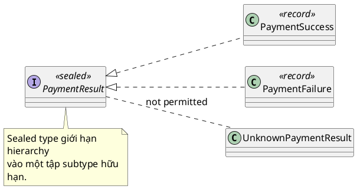

# sealed class

## What is it

`sealed class` hoặc `sealed interface` cho phép bạn giới hạn chính xác những subtype nào được phép kế thừa hoặc implement.

Thay vì để bất kỳ ai cũng có thể tạo subtype mới, bạn khai báo một tập subtype hữu hạn bằng `permits`.

Mental model tốt là: sealed type biến một hierarchy mở thành một hierarchy có biên rõ ràng.

## How I used to misunderstand it

Mình từng nhầm sealed class chỉ là một dạng `final` phức tạp hơn.

Thật ra `final` chặn mọi subclass, còn `sealed` cho phép một số subclass được chọn.

Cũng dễ nhầm sealed class chỉ phục vụ “design pattern đẹp hơn”, nhưng lợi ích thực tế lớn là compiler reasoning tốt hơn, nhất là khi kết hợp với pattern matching hoặc switch exhaustive.

## How it actually works

Một sealed type khai báo `permits` danh sách subtype hợp lệ.



Mỗi subtype phải tiếp tục khai báo là `final`, `sealed`, hoặc `non-sealed`.

Điều này tạo ra một hierarchy có shape rõ. Khi compiler biết hierarchy là hữu hạn, nhiều logic branch sẽ an toàn hơn vì bạn có thể cover đủ tất cả variants mà không sợ subtype lạ xuất hiện ở nơi khác.

### Advanced type comparison

| Nếu bạn cần... | `sealed class` | `enum` | `record` |
|---|---|---|---|
| Closed hierarchy của nhiều variant | Rất hợp | Hạn chế | No |
| Mỗi variant có payload khác nhau | Rất hợp | Hạn chế | Một shape duy nhất thôi |
| Chỉ cần constant hữu hạn | Có thể nhưng dư | Rất hợp | No |
| Một immutable data carrier đơn giản | Có thể nhưng nặng | No | Rất hợp |

### Tiny decision scaffold

```text
Need a closed set of different subtypes? -> sealed class
Need finite constants only? -> enum
Need one immutable data shape? -> record
```

Sealed type đặc biệt hữu ích cho algebraic-style modeling trong Java, ví dụ payment result có thể là `Success`, `Failure`, `PendingReview`.

Thay vì dùng field `type` cộng nhiều nullable field, bạn mô hình hóa mỗi variant thành một subtype riêng.

## Code example

```java
sealed interface PaymentResult permits PaymentSuccess, PaymentFailure {
}

record PaymentSuccess(String transactionId) implements PaymentResult {
}

record PaymentFailure(String reason) implements PaymentResult {
}

public class Main {
    public static void main(String[] args) {
        PaymentResult result = new PaymentSuccess("tx-1");
        System.out.println(result);
    }
}
```

## When to use / when NOT to use

Dùng sealed class khi domain có số variant hữu hạn và bạn muốn compiler biết rõ hierarchy, như command, result, state trong business logic.

Không dùng sealed class nếu hierarchy phải mở cho plugin hoặc extensibility từ module ngoài.

Nếu subtype list thay đổi liên tục bởi third-party extension, sealed sẽ gây cản trở hơn là lợi ích.

## How this connects to real Java projects

Trong Spring Boot, sealed type hữu ích cho modeling response state, domain command, validation result, hoặc event hierarchy nội bộ.

Nó giúp service layer và controller mapping rõ hơn khi business state có số biến thể hữu hạn.

Nhưng nếu dữ liệu phải deserialize linh hoạt từ nhiều nguồn ngoài hoặc framework cần proxy subclass mở rộng, cần cân nhắc kỹ trước khi sealed toàn bộ hierarchy.

## Gotchas

- Mỗi subtype của sealed type bắt buộc phải khai báo `final`, `sealed`, hoặc `non-sealed`.
- Sealed hierarchy đẹp hơn type flag cộng nullable field, nhưng nếu lạm dụng có thể tạo quá nhiều lớp nhỏ không cần thiết.
- Lợi ích lớn nhất của sealed class thường chỉ lộ rõ khi đi cùng pattern matching hoặc exhaustive branching.
- Nếu domain thật ra cần mở rộng bởi code ngoài hệ thống, sealed có thể khóa sai chỗ.

## Handbook rule

- Dùng sealed khi hierarchy hữu hạn, đóng theo design, để compiler biết exhaustive branching.
- Mỗi subtype phải là `final`, `sealed`, hoặc `non-sealed`; không bỏ trống modifier.
- Lợi ích lớn nhất khi đi kèm pattern matching và exhaustive switch.
- Không dùng sealed nếu hierarchy cần mở cho plugin/third-party extension.
- Quá nhiều subtype nhỏ là dấu hiệu over-modeling; gộp lại nếu không có hành vi khác biệt.

## Check yourself

- `sealed` khác `final` ở điểm nào?
- Khi nào sealed class đáng dùng hơn enum?
- Vì sao sealed class hợp với variants có payload khác nhau?
- Nếu hierarchy phải mở cho plugin bên ngoài, sealed có còn hợp không?
- Pattern matching được lợi gì khi hierarchy là sealed?

## Exercises

### Bài 1: Describe Payment Result Variant
Độ khó: Dễ

Đề bài:
Cho một sealed `PaymentResult`, trả về description string cho variant đó. `PaymentSuccess` trả về `"success"`, còn `PaymentFailure` trả về `"failure"`.

Ví dụ 1:
Đầu vào:
```text
result = PaymentFailure("timeout")
```

Đầu ra:
```text
"failure"
```

Giải thích:
Subtype quyết định text đầu ra.

Ràng buộc:
- result là non-null
- Chỉ các variant được permit mới được xuất hiện
- Không dùng string type flag

### Bài 2: Count Reviewable Command Variants
Độ khó: Trung bình

Đề bài:
Cho một list các sealed command variant, đếm xem có bao nhiêu variant cần manual review. Chỉ có `ManualReviewCommand` là reviewable.

Ví dụ 1:
Đầu vào:
```text
commands = [AutoApproveCommand(), ManualReviewCommand(), ManualReviewCommand()]
```

Đầu ra:
```text
2
```

Giải thích:
Chỉ có một variant đóng góp vào số đếm.

Ràng buộc:
- 0 <= commands.length <= 100000
- commands[i] là non-null
- Các variant thuộc cùng một sealed hierarchy

### Bài 3: Sum Success Payload Amounts
Độ khó: Trung bình

Đề bài:
Cho một list các sealed payment event variant, chỉ cộng amount từ các event `PaymentCaptured`. Bỏ qua toàn bộ variant còn lại.

Ví dụ 1:
Đầu vào:
```text
events = [PaymentCreated(100), PaymentCaptured(100), PaymentFailed(50)]
```

Đầu ra:
```text
100
```

Giải thích:
Chỉ có captured event đóng góp vào tổng.

Ràng buộc:
- 0 <= events.length <= 100000
- events[i] là non-null
- Bỏ qua các variant không mang captured amount

## Links

- [[001-enum]]
- [[002-record]]
- [[004-pattern-matching]]
- [[../../00_Mental-Models/010-Interface-vs-Abstract]]
- Java language guide, sealed classes: https://docs.oracle.com/en/java/javase/21/language/sealed-classes-and-interfaces.html
