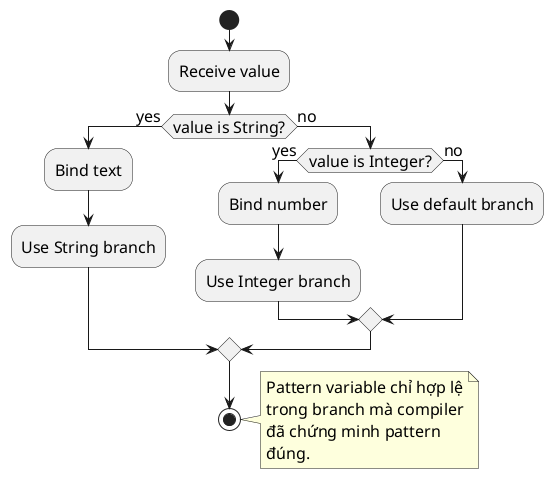

# Pattern Matching

## What is it

Pattern matching trong Java là cách vừa kiểm tra shape hoặc type, vừa bind dữ liệu liên quan ngay trong cùng một biểu thức.

Thay vì `instanceof` rồi cast tay, bạn có thể viết `if (obj instanceof User user)` để vừa check type vừa có biến `user` an toàn trong scope đúng.

Mental model: pattern matching giảm khoảng cách giữa “đây là kiểu gì?” và “nếu đúng kiểu đó thì lấy dữ liệu nào?”.

## How I used to misunderstand it

Mình từng nghĩ pattern matching chỉ là syntax sugar cho cast.

Nó đúng một phần, nhưng đánh giá thấp lợi ích của compiler flow analysis. Compiler biết khi nào pattern variable hợp lệ, giúp giảm cast lặp lại, giảm bug scope, và đặc biệt mạnh khi đi cùng sealed hierarchy hoặc switch expression.

Nó làm code bớt ceremony chứ không chỉ ngắn hơn.

## How it actually works

Pattern matching cho `instanceof` cho phép type test và binding trong một bước.

Với Java hiện đại hơn, pattern matching cũng mở rộng cho `switch`, giúp branch theo shape hoặc type của object rõ hơn.

Khi kết hợp với sealed class, compiler có thể hỗ trợ reasoning về exhaustiveness tốt hơn nữa.

Điều quan trọng là pattern variable chỉ sống trong nhánh mà pattern đã được chứng minh đúng.



### Advanced type comparison

| Câu hỏi | Pattern matching | Cast tay kiểu cũ |
|---|---|---|
| Kiểm tra type và bind cùng lúc | Yes | No |
| Giảm cast lặp lại | Yes | No |
| Compiler reasoning về scope | Tốt hơn | Yếu hơn |
| Phát huy mạnh với sealed hierarchy | Yes | Ít hơn |

### Scaffold chọn nhanh

```text
Cần branch theo runtime type và dùng dữ liệu subtype ngay? -> pattern matching
Cần variant đóng với exhaustive reasoning? -> kết hợp với sealed class
Cần mapping từ selector sang value? -> pattern matching + switch có thể hợp
```

## Code example

```java
public class Main {
    static String describe(Object value) {
        if (value instanceof String text) {
            return "text:" + text.toUpperCase();
        }
        if (value instanceof Integer number) {
            return "number:" + (number + 1);
        }
        return "other";
    }

    public static void main(String[] args) {
        System.out.println(describe("java")); // text:JAVA
    }
}
```

## When to use / when NOT to use

Dùng pattern matching khi cần branch theo type hoặc shape và dùng dữ liệu bên trong ngay sau check.

Nó đặc biệt hợp với sealed hierarchy, DTO variant, error result polymorphic, hoặc object list không đồng nhất.

Không dùng chỉ để “trông hiện đại hơn” nếu code vốn đã rõ ràng với API tĩnh hoặc generic type đúng.

Nếu logic không thật sự branch theo type, pattern matching chỉ làm code thêm màu mè.

## How this connects to real Java projects

Trong Spring Boot, pattern matching hữu ích khi xử lý domain result nhiều variant, application event khác loại, hoặc mapping exception hoặc result object sang response.

Nó giúp controller hoặc service code bớt cast tay và rõ intent hơn.

Tuy nhiên nếu bạn xử lý input JSON động hoặc `Object` quá nhiều, đó cũng có thể là dấu hiệu domain model chưa đủ chặt.

## Gotchas

- Pattern variable chỉ sống trong scope nơi compiler biết pattern đúng.
- Đừng lạm dụng pattern matching để che đi domain model yếu kiểu mọi thứ đều là `Object`.
- Lợi ích cao nhất thường đến khi kết hợp với sealed type hoặc switch expression, không phải khi dùng lẻ tẻ mọi nơi.
- Nếu code liên tục branch theo type của object ngẫu nhiên, có thể bạn đang thiếu abstraction tốt hơn.

## Handbook rule

- Pattern matching dùng khi branch theo type/shape và cần dữ liệu trong nhánh đó.
- Kết hợp với sealed hierarchy để switch exhaustive, không phải chỉ thay `instanceof`.
- Không dùng pattern matching để giấu logic phức tạp trong một switch dài; tách method.
- Bind variable trong pattern phải dùng đúng scope, không reuse ngoài nhánh match.
- Dùng `default`/exhaustive đầy đủ; tránh fallthrough ngầm.

## Check yourself

- Pattern matching giảm bớt ceremony nào so với `instanceof` cộng cast tay?
- Vì sao scope của pattern variable là một phần quan trọng của tính an toàn?
- Khi nào sealed class làm pattern matching mạnh hơn hẳn?
- Nếu code của bạn đầy `Object`, pattern matching đang giúp thật hay chỉ che thiết kế yếu?
- Khi nào `switch expression` và pattern matching phối hợp tốt với nhau?

## Exercises

### Bài 1: Describe Object By Type
Độ khó: Dễ

Đề bài:
Cho một `Object`, trả về `"text"` nếu nó là `String`, `"number"` nếu nó là `Integer`, và `"other"` trong các trường hợp còn lại.

Ví dụ 1:
Đầu vào:
```text
value = "hello"
```

Đầu ra:
```text
"text"
```

Giải thích:
Input khớp với type pattern `String`.

Ràng buộc:
- `value` có thể là `null`
- Chỉ `String` và `Integer` cần xử lý đặc biệt
- Type không biết trước trả về `"other"`

### Bài 2: Sum Integers From Mixed Values
Độ khó: Trung bình

Đề bài:
Cho một list gồm nhiều giá trị `Object` lẫn nhau, trả về tổng các phần tử khớp với pattern `Integer`.

Ví dụ 1:
Đầu vào:
```text
values = ["a", 2, 5, "b"]
```

Đầu ra:
```text
7
```

Giải thích:
Chỉ các giá trị integer mới đóng góp vào tổng.

Ràng buộc:
- 0 <= values.length <= 100000
- values[i] may be `null`
- Ignore non-integer values

### Bài 3: Extract Success Message From Sealed Result
Độ khó: Trung bình

Đề bài:
Cho một sealed result hierarchy với các variant `Success` và `Failure`, trả về success message khi input khớp với `Success`. Nếu không, trả về empty string.

Ví dụ 1:
Đầu vào:
```text
result = Success("done")
```

Đầu ra:
```text
"done"
```

Giải thích:
Pattern matching vừa check variant, vừa bind success payload.

Ràng buộc:
- result là non-null
- Các variant thuộc cùng một sealed hierarchy
- Trả về empty string cho các non-success variant

## Links

- [[001-enum]]
- [[003-sealed-class]]
- [[../Control-Flow/002-switch-expression]]
- Java language guide, pattern matching for instanceof: https://docs.oracle.com/en/java/javase/21/language/pattern-matching-instanceof.html
