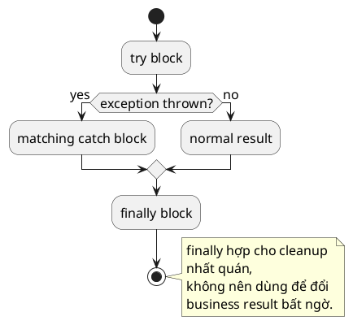

# try-catch-finally

## What is it

`try-catch-finally` là cấu trúc để bao một đoạn code có thể ném exception, xử lý exception phù hợp, và chạy cleanup logic nếu cần.

Mental model:

- `try` là vùng rủi ro
- `catch` là nhánh xử lý failure
- `finally` là nơi cleanup gần như luôn phải chạy sau đó

## How I used to misunderstand it

Mình từng nghĩ cứ có exception là nhét `try-catch` vào cho “an toàn”. Kết quả là code nuốt lỗi, log mơ hồ, hoặc trả default value sai.

Cũng hay hiểu lầm `finally` là nơi nên đặt mọi logic “quan trọng”. Thực ra `finally` hợp với cleanup nhất quán. Nhiều business action không phải cleanup thì không nên nằm đó, vì block này chạy cả lúc success lẫn failure.

## How it actually works

`try` bao code có thể fail.

Nếu exception được ném ra và match một `catch`, flow đi vào block đó.

`finally` chạy sau `try` hoặc `catch` trong hầu hết trường hợp, kể cả khi có `return` trong `try` hoặc `catch`.

Vì vậy `finally` hợp với cleanup như đóng resource, clear `ThreadLocal`, release lock, hoặc ghi metric timing. Nó không hợp để che lỗi hoặc đổi semantics của business result một cách bất ngờ.

### Branch decision table

| Nhu cầu | Dùng `catch` | Dùng `finally` | Vì sao |
|---|---|---|---|
| Translate low-level exception thành domain exception | Yes | No | Đây là xử lý failure |
| Log thêm context cho failure | Yes | No | Chỉ xảy ra khi có exception |
| Đóng resource thủ công | No hoặc rất ít | Yes | Cleanup phải chạy ở cả success lẫn failure |
| Clear trạng thái tạm | No | Yes | Không phụ thuộc việc có lỗi hay không |
| Đổi return value cuối cùng | Tránh | Tránh trong `finally` | Dễ làm flow khó đoán |

### Cleanup flow scaffold



```text
try      -> work may succeed or fail
catch    -> recover, translate, or rethrow
finally  -> cleanup that should happen either way
```

Thứ tự `catch` cũng quan trọng.

Catch hẹp phải đứng trước catch rộng. Nếu bạn bắt `Exception` quá sớm, các catch cụ thể phía sau thành unreachable hoặc mất meaning.

## Code example

```java
public class Main {
    static String parseAge(String input) {
        try {
            return "age=" + Integer.parseInt(input);
        } catch (NumberFormatException e) {
            return "invalid";
        } finally {
            System.out.println("parse attempt finished");
        }
    }
}
```

## When to use / when NOT to use

Dùng `try-catch` khi bạn thật sự có strategy xử lý như translate exception, fallback, retry, thêm domain context, hoặc quyết định rethrow kiểu khác.

Dùng `finally` khi có cleanup nhất quán phải chạy sau operation.

Không dùng `catch (Exception)` chỉ để log và nuốt lỗi.

Không dùng `finally` để đổi return value, ghi business state chính, hoặc nhét logic khiến người đọc không đoán được method sẽ kết thúc ra sao.

Nếu mục tiêu chỉ là đóng resource, hãy ưu tiên `try-with-resources` hơn `finally` thủ công.

## How this connects to real Java projects

Trong Spring Boot, nhiều exception handling được đẩy lên framework qua filter, interceptor, transaction boundary, và `@ControllerAdvice`.

Điều đó không làm `try-catch` biến mất. Nó chỉ đẩy bạn tới chỗ phù hợp hơn.

Ở service hoặc integration layer, bạn vẫn cần `try-catch` để wrap low-level exception thành business exception rõ hơn. Nhưng đừng bắt quá sớm ở mọi method nhỏ, nếu cuối cùng chỉ log rồi ném lại cùng lỗi.

## Gotchas

- `finally` vẫn chạy sau `return`, nên side effect trong đó có thể gây bất ngờ.
- Catch quá rộng làm mất khả năng xử lý failure cụ thể.
- Nuốt exception rồi trả default value mơ hồ thường tạo bug khó trace hơn để lỗi nổi lên đúng chỗ.
- `finally` không thay thế được `try-with-resources` cho resource cleanup hiện đại.

## Handbook rule

- Chỉ catch khi có strategy thật: dịch exception, retry, fallback, thêm context, hoặc rethrow kiểu rõ hơn.
- Không `catch (Exception)` để log rồi nuốt; chọn type cụ thể hoặc để bubble.
- `finally` chỉ làm cleanup; không đổi return value, không nhét business state.
- Resource cleanup ưu tiên `try-with-resources`, không `finally` thủ công.
- Side effect trong `finally` chạy cả khi method `return`/throw; tính trước hệ quả.

## Check yourself

- Khi nào `catch` nên translate exception, và khi nào nên để nó nổi lên?
- Vì sao `finally` hợp với cleanup hơn là business logic?
- Nếu có `return` trong `try`, `finally` còn chạy không, và điều đó gây bẫy gì?
- Vì sao `catch (Exception)` thường là dấu hiệu xử lý quá rộng?
- Nếu mục tiêu duy nhất là đóng file hoặc stream, vì sao `try-with-resources` thường tốt hơn?

## Exercises

### Bài 1: Parse Integer Or Default
Độ khó: Dễ

Đề bài:
Cho một text và một default number, parse giá trị số nguyên. Trả về default number nếu việc parse thất bại.

Ví dụ 1:
Đầu vào:
```text
text = "42", defaultValue = -1
```

Đầu ra:
```text
42
```

Giải thích:
Text được parse thành công, nên parsed number được trả về.

Ràng buộc:
- text là non-null
- defaultValue may be any integer
- Chỉ xử lý trường hợp number parsing failure

### Bài 2: Close Flag In Finally
Độ khó: Trung bình

Đề bài:
Cho một simulated operation có thể fail, trả về việc cleanup flag có luôn được set trong `finally` sau lần thử hay không.

Ví dụ 1:
Đầu vào:
```text
shouldFail = true
```

Đầu ra:
```text
true
```

Giải thích:
Cleanup flag được set trong `finally` ngay cả khi operation ném exception.

Ràng buộc:
- Cleanup phải xảy ra cho cả success lẫn failure
- Không được dựa vào duplicated cleanup code ở `try` và `catch`
- Chỉ trả về việc cleanup có chạy hay không

### Bài 3: Translate Number Format Failure
Độ khó: Trung bình

Đề bài:
Cho một text đáng lẽ phải chứa integer, parse nó và ném `IllegalArgumentException` với custom message khi text không hợp lệ.

Ví dụ 1:
Đầu vào:
```text
text = "abc"
```

Đầu ra:
```text
IllegalArgumentException("age must be numeric")
```

Giải thích:
Low-level parse failure được translate thành contract error dễ hiểu hơn cho business.

Ràng buộc:
- text là non-null
- Preserve the original cause when translating
- Parse thành công thì trả về integer result

## Links

- [[001-Checked-vs-Unchecked]]
- [[003-try-with-resources]]
- [[004-custom-exception]]
- Java exception tutorial: https://docs.oracle.com/javase/tutorial/essential/exceptions/
- `Exception` Javadoc: https://docs.oracle.com/en/java/javase/21/docs/api/java.base/java/lang/Exception.html
