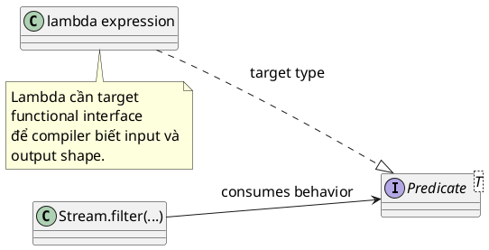

# lambda

## What is it

Lambda là cách viết ngắn gọn cho một khối logic có thể truyền vào method khác như một giá trị. Trong Java, lambda luôn đi kèm một functional interface như `Predicate`, `Function`, `Consumer`, `Supplier`.

Mental model dễ nhớ:

- lambda là phần **behavior thay đổi được**
- functional interface là **shape của behavior đó**
- method nhận lambda là nơi **sử dụng behavior**

Nói ngắn gọn, lambda giúp bạn nói rõ: “đoạn logic nhỏ nào cần cắm vào đây”.

## How I used to misunderstand it

Mình từng nghĩ lambda chỉ là anonymous class viết ngắn đi.

Điều đó đúng một phần về cú pháp, nhưng chưa chạm vào payoff chính. Giá trị thật của lambda là làm lộ ra phần logic biến đổi trong một operation. Ví dụ ở `filter`, phần thay đổi thật sự chỉ là điều kiện giữ hay bỏ phần tử. Boilerplate lặp qua collection không còn che mất ý chính nữa.

Một hiểu nhầm khác là thấy lambda rồi nghĩ code tự nhiên “functional” và sạch hơn. Không hẳn. Lambda ngắn thì rõ. Lambda dài, nhiều branch, nhiều side effect thì còn khó đọc hơn method thường.

## How it actually works

Lambda không tồn tại độc lập như một function top-level. Nó phải có **target type**, thường là một functional interface có đúng một abstract method.



Ví dụ:

- `name -> name.length() >= 3` có thể là `Predicate<String>`
- `name -> name.toUpperCase()` có thể là `Function<String, String>`

Cùng một shape cú pháp, nhưng ý nghĩa phụ thuộc target type.

Lambda cũng chỉ capture local variable nếu variable đó **effectively final**. Tức là bạn có thể đọc biến ngoài, nhưng không được sửa nó theo kiểu mutation tùy ý như ở một số ngôn ngữ khác.

### Lambda, method reference, functional interface

| Khái niệm | Vai trò | Ví dụ | Câu hỏi nó trả lời |
|---|---|---|---|
| Lambda | Logic inline | `x -> x > 0` | Làm gì với input này? |
| Method reference | Reuse method sẵn có | `String::trim` | Nếu logic chỉ là gọi method có sẵn thì sao? |
| Functional interface | Contract nhận behavior | `Predicate<String>` | Behavior này có input/output shape gì? |

### Decision shortcut

```text
Need tiny behavior inline? -> lambda
Lambda only forwards to an existing method? -> method reference
Need to define the contract that receives behavior? -> functional interface
```

## Code example

```java
import java.util.List;

public class Main {
    public static void main(String[] args) {
        List<String> names = List.of("Linh", "An", "Binh");

        names.stream()
                .filter(name -> name.length() >= 3)
                .forEach(System.out::println);
    }
}
```

Ở đây:

- `name -> name.length() >= 3` là lambda làm vai trò `Predicate<String>`
- `System.out::println` là method reference, tức một cách viết gọn hơn của `name -> System.out.println(name)`

## When to use / when NOT to use

Dùng lambda khi logic ngắn, local, và đọc lên là hiểu ngay mục đích, như filter, map, sort comparator, callback nhỏ.

Không nên nhét quá nhiều business logic vào một lambda dài nhiều dòng. Khi logic có nhiều branch, nhiều state, hoặc cần tên gọi rõ nghĩa, tách ra thành method thường sẽ dễ đọc và dễ test hơn.

Đừng functional hóa mọi thứ chỉ vì cú pháp mới hơn. Nếu một `for` loop đơn giản đọc tự nhiên hơn, cứ dùng loop.

## How this connects to real Java projects

Trong Spring Boot, lambda xuất hiện rất nhiều ở stream pipeline, callback config, retry template, async task, comparator sort response, hoặc mapping entity sang DTO.

Điểm quan trọng là lambda thường hợp với logic nhỏ và gần nơi dùng. Nếu rule đủ lớn để trở thành domain concept riêng, method đặt tên tốt hoặc mapper riêng thường rõ hơn.

## Gotchas

- Lambda chỉ capture effectively final local variable.
- Target type quyết định lambda này đang là `Predicate`, `Function`, `Consumer`, hay thứ khác.
- Lambda ngắn thì đẹp, lambda nhiều side effect sẽ rất khó debug.
- Đừng dùng lambda để che đi logic đáng lẽ nên có tên riêng.

## Handbook rule

- Lambda chỉ dùng cho logic ngắn, không nhiều branch/state; logic dài tách method.
- Lambda chỉ capture effectively final local variable; không workaround bằng array trick.
- Side effect trong lambda là tín hiệu code cần tách ra cho dễ debug.
- Target type quyết định lambda là `Predicate`/`Function`/`Consumer`; viết signature rõ.
- Đừng functional hóa code chỉ vì cú pháp mới; loop đơn giản vẫn hợp lệ.

## Check yourself

- Vì sao nói lambda là behavior value chứ không phải function độc lập trong Java?
- Khi nào nên đổi từ lambda sang method thường có tên?
- `name -> name.trim()` khác gì `String::trim` về ý nghĩa và độ rõ?
- Vì sao target type lại quan trọng với lambda?
- Nếu muốn sửa local variable từ bên trong lambda, vì sao compiler thường chặn bạn?

## Exercises

### Bài 1: Filter Long Names With Lambda
Độ khó: Dễ

Đề bài:
Cho một list các tên và một độ dài tối thiểu, chỉ trả về những tên có độ dài lớn hơn hoặc bằng giá trị tối thiểu đó.

Ví dụ 1:
Đầu vào:
```text
names = ["An", "Binh", "Ly"], minLength = 3
```

Đầu ra:
```text
["Binh"]
```

Giải thích:
Chỉ có `"Binh"` thỏa điều kiện độ dài tối thiểu.

Ràng buộc:
- 0 <= names.length <= 100000
- names[i] là non-null
- Giữ nguyên encounter order

### Bài 2: Transform Names To Uppercase
Độ khó: Dễ

Đề bài:
Cho một list các tên, trả về một list mới chứa dạng uppercase của từng tên.

Ví dụ 1:
Đầu vào:
```text
names = ["Linh", "An"]
```

Đầu ra:
```text
["LINH", "AN"]
```

Giải thích:
Mỗi phần tử được transform một cách độc lập.

Ràng buộc:
- 0 <= names.length <= 100000
- names[i] là non-null
- Kích thước output phải khớp với kích thước input

### Bài 3: Sort By Custom Length Rule
Độ khó: Trung bình

Đề bài:
Cho một list các từ, trả về chúng đã được sắp xếp theo độ dài tăng dần. Nếu hai từ có cùng độ dài, sắp xếp theo alphabet.

Ví dụ 1:
Đầu vào:
```text
words = ["pear", "a", "cat", "go"]
```

Đầu ra:
```text
["a", "go", "cat", "pear"]
```

Giải thích:
Từ ngắn hơn đứng trước, còn tie sẽ được resolve theo alphabet.

Ràng buộc:
- 0 <= words.length <= 100000
- words[i] là non-null
- Chỉ trả về sorted result

## Links

- [[002-Functional-Interface]]
- [[003-Stream-API]]
- [[005-Method-reference]]
- `java.util.function` package summary: https://docs.oracle.com/en/java/javase/21/docs/api/java.base/java/util/function/package-summary.html
- Java tutorial, Lambda Expressions: https://docs.oracle.com/javase/tutorial/java/javaOO/lambdaexpressions.html
