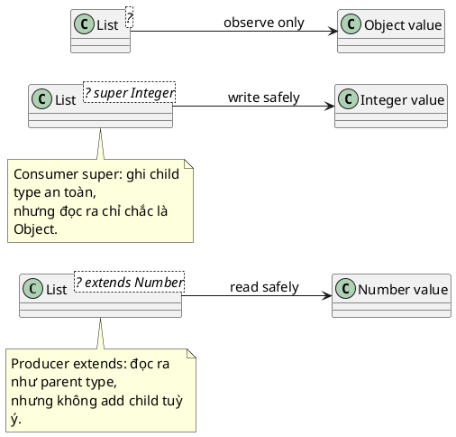

# Wildcard

## What is it

Wildcard trong generics là ký hiệu `?` dùng khi bạn không biết, hoặc không muốn buộc chặt, type parameter cụ thể.

Hai dạng bound hay gặp là:

- `? extends T`
- `? super T`

Mental model dễ nhớ là **PECS**:

- **Producer extends**
- **Consumer super**

## How I used to misunderstand it

Mình từng nghĩ `List<Object>` và `List<?>` gần như giống nhau.

Không giống. `List<Object>` là list của đúng kiểu `Object`. `List<?>` là list của **một kiểu nào đó chưa biết**. Vì chưa biết kiểu thật là gì, compiler không cho bạn add bừa giá trị vào `List<?>` ngoài `null`.

Mình cũng từng dùng `extends` và `super` theo cảm tính, rồi bị compiler từ chối mà không hiểu vì sao.

## How it actually works

Wildcard là cách Java mô tả variance ở **use-site**. Nó giúp API nói rõ: input này cần linh hoạt kiểu nào, để **đọc**, để **ghi**, hay chỉ để **quan sát**.



### Bảng mental model quan trọng nhất

| Signature | Bạn làm tốt việc gì | Bạn không làm tốt việc gì |
|---|---|---|
| `List<?>` | đọc như `Object` | add gần như mọi thứ |
| `List<? extends Number>` | đọc như `Number` | add `Integer`, `Double` tùy ý |
| `List<? super Integer>` | add `Integer` an toàn | đọc ra như `Integer` |

### Vì sao như vậy

Nếu một parameter là `List<? extends Number>`, list thật phía sau có thể là:

- `List<Integer>`
- `List<Double>`
- `List<BigDecimal>`

Bạn đọc ra an toàn dưới dạng `Number`, nhưng không thể chắc add `Integer` vào mọi trường hợp.

Ngược lại, với `List<? super Integer>`, list thật có thể là `List<Integer>`, `List<Number>`, hoặc `List<Object>`. Vì thế add `Integer` là an toàn, nhưng khi đọc ra bạn chỉ biết chắc nó là `Object`.

### Decision shortcut

```text
Need to read values as a parent type? -> ? extends T
Need to write values of a child type? -> ? super T
Need neither, just unknown type? -> ?
```

## Code example

```java
import java.util.List;

public class Main {
    static int sum(List<? extends Number> numbers) {
        int total = 0;
        for (Number number : numbers) {
            total += number.intValue();
        }
        return total;
    }
}
```

## When to use / when NOT to use

Dùng wildcard khi method cần input flexible hơn một generic type cố định, nhất là ở utility API hoặc abstraction chung.

Dùng `extends` cho producer read-oriented. Dùng `super` cho consumer write-oriented.

Không thêm wildcard chỉ để trông generic hơn. Nếu signature với concrete type parameter đã rõ và đủ dùng, cứ giữ đơn giản.

## How this connects to real Java projects

Trong Spring Boot, bạn sẽ không phải tự viết wildcard rất phức tạp mỗi ngày. Nhưng hiểu wildcard giúp đọc framework API, mapper helper, validator, factory, hoặc abstraction chung nhận nhiều subtype tốt hơn.

Rất nhiều khó chịu khi đọc generic API thực ra chỉ là câu hỏi: chỗ này đang muốn **đọc**, **ghi**, hay **cả hai**?

## Gotchas

- `List<Object>` không thay thế cho `List<String>`.
- `List<?>` gần như không cho add gì ngoài `null`.
- `? extends T` đọc tốt nhưng ghi kém.
- `? super T` ghi tốt nhưng đọc ra không cụ thể.
- Quá nhiều wildcard lồng nhau làm API khó đọc rất nhanh.

## Handbook rule

- PECS: producer dùng `? extends T`, consumer dùng `? super T`.
- `List<Object>` không thay được `List<String>`; phương sai phải đi qua wildcard.
- `List<?>` gần như chỉ đọc; không add ngoài `null`.
- Tránh wildcard lồng nhau quá nhiều; signature phải đọc được trong một đoạn.
- Concrete type parameter đủ dùng thì không cần thêm wildcard cho “trông generic hơn”.

## Check yourself

- Vì sao `List<Object>` và `List<?>` khác nhau?
- Khi nào dùng `? extends Number` thay vì `List<Number>`?
- Vì sao `List<? super Integer>` cho add `Integer` nhưng đọc ra thường chỉ an toàn như `Object`?
- PECS giúp bạn nhớ điều gì?
- Nếu một method vừa muốn đọc chính xác vừa muốn ghi chính xác cùng một type, wildcard có luôn là lựa chọn tốt nhất không?

## Exercises

### Bài 1: Sum Numbers With Extends
Độ khó: Dễ

Đề bài:
Cho một list số được typed là `? extends Number`, trả về integer sum của toàn bộ giá trị.

Ví dụ 1:
Đầu vào:
```text
numbers = [1, 2, 3]
```

Đầu ra:
```text
6
```

Giải thích:
Method đọc giá trị an toàn thông qua upper bound.

Ràng buộc:
- 0 <= numbers.length <= 100000
- numbers[i] là non-null
- Chỉ đọc giá trị

### Bài 2: Add Integers To Consumer List
Độ khó: Trung bình

Đề bài:
Cho một target list được typed là `? super Integer` và một list các số nguyên, add toàn bộ số nguyên vào target list rồi trả về kích thước cuối cùng.

Ví dụ 1:
Đầu vào:
```text
target = [10], values = [1, 2]
```

Đầu ra:
```text
3
```

Giải thích:
Lower bound đảm bảo rằng việc add integer là an toàn.

Ràng buộc:
- target là non-null
- values là non-null
- values[i] là non-null

### Bài 3: Copy Numbers Between Compatible Lists
Độ khó: Trung bình

Đề bài:
Cho source list kiểu `? extends Integer` và destination list kiểu `? super Integer`, copy toàn bộ source value sang destination rồi trả về kích thước của destination.

Ví dụ 1:
Đầu vào:
```text
source = [1, 2], destination = [10]
```

Đầu ra:
```text
3
```

Giải thích:
Source đóng vai trò producer của integer còn destination là consumer của chúng.

Ràng buộc:
- source là non-null
- destination là non-null
- source[i] là non-null

## Links

- [[001-what-is-T]]
- [[003-type-erasure]]
- [[004-generic-method-vs-generic-class]]
- Java tutorial, Wildcards: https://docs.oracle.com/javase/tutorial/java/generics/wildcards.html
- Java tutorial, Guidelines for Wildcard Use: https://docs.oracle.com/javase/tutorial/java/generics/wildcardGuidelines.html
