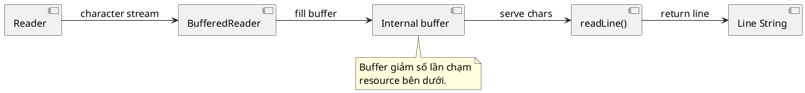

# BufferedReader

## What is it

`BufferedReader` là wrapper cho `Reader` giúp đọc text hiệu quả hơn bằng cách buffer dữ liệu và cung cấp API tiện như `readLine()`.

Mental model: thay vì mỗi lần đọc là chạm xuống nguồn dữ liệu chậm, `BufferedReader` lấy một cục lớn vào memory rồi phục vụ các lần đọc nhỏ từ buffer.

## How I used to misunderstand it

Mình từng nghĩ `BufferedReader` chỉ dùng để đọc từng dòng cho đẹp code.

Điểm chính là nó giảm số lần gọi xuống resource bên dưới, nhất là file hoặc network. `readLine()` chỉ là API rất hữu ích đi kèm.

Điều này đặc biệt đáng giá khi bạn xử lý text theo kiểu streaming, từng dòng một, thay vì load toàn bộ file vào memory.

## How it actually works

`BufferedReader` nhận một `Reader`, giữ một vùng nhớ đệm, và đọc trước dữ liệu vào đó.

Khi gọi `readLine()`, nó gom character cho đến line terminator hoặc EOF.



Dòng trả về không chứa ký tự xuống dòng.

### Reader stack mental model

```text
InputStream -> InputStreamReader(charset) -> BufferedReader -> readLine()
```

### Comparison table

| Nhu cầu | `Reader` thường | `BufferedReader` |
|---|---|---|
| Đọc từng character đơn lẻ | Có thể đủ | Có thể dùng nhưng chưa chắc cần |
| Đọc text theo dòng | Không tiện | Rất hợp |
| Giảm số lần chạm resource | Hạn chế | Yes |
| Xử lý file lớn theo streaming | Có thể | Thường rõ và tiện hơn |

## Code example

```java
import java.io.BufferedReader;
import java.io.StringReader;

try (BufferedReader reader = new BufferedReader(new StringReader("a\nb"))) {
    System.out.println(reader.readLine()); // a
    System.out.println(reader.readLine()); // b
}
```

## When to use / when NOT to use

Dùng `BufferedReader` khi cần đọc text theo dòng hoặc muốn giảm overhead khi đọc nhiều character.

Không dùng nó cho binary data.

Nếu chỉ cần đọc toàn bộ file nhỏ, `Files.readString` có thể đơn giản hơn.

Nếu file rất lớn, đọc từng dòng vẫn tốt hơn load hết vào một `String`.

Nếu bạn chỉ cần parse một chuỗi nhỏ đã có sẵn trong memory, `BufferedReader` có thể không tạo thêm nhiều giá trị.

## How this connects to real Java projects

Trong Spring apps, bạn có thể gặp pattern đọc line khi import CSV, đọc log, xử lý file upload dạng text, hoặc parse resource nội bộ.

Với request hoặc response thường framework đã xử lý, nhưng khi viết integration hoặc batch job, hiểu `BufferedReader` giúp tránh load file lớn vào memory.

Nó cũng giúp bạn phân biệt rõ chỗ nào đang xử lý text streaming, chỗ nào đang xử lý whole-file convenience API.

## Gotchas

- `readLine()` trả `null` ở EOF, không phải empty string.
- Dòng rỗng là `""`, khác với EOF.
- `BufferedReader` không tự biết charset. Charset phải được xử lý ở `Reader` bên dưới.
- `readLine()` bỏ ký tự xuống dòng, nên nếu bạn cần giữ nguyên formatting gốc, hãy chủ động ghép lại.

## Handbook rule

- `BufferedReader` chỉ dùng cho text; không bọc binary stream.
- `readLine()` trả `null` ở EOF; empty line là `""`, đừng nhầm hai trạng thái.
- Charset phải set ở `Reader` bên dưới; đừng dựa vào default charset của JVM.
- File rất lớn đọc theo dòng, không load hết vào memory.
- Mọi reader/stream phải dùng `try-with-resources` để đóng đúng.

## Check yourself

- Vì sao `BufferedReader` hợp với file text lớn hơn `Files.readString` trong nhiều bài toán batch?
- `readLine()` khác gì với đọc ký tự từng cái một?
- Vì sao `BufferedReader` không giải quyết được bài toán charset?
- EOF và dòng rỗng khác nhau như thế nào?
- Khi nào `BufferedReader` chỉ làm code dài hơn mà không thêm nhiều giá trị?

## Exercises

### Bài 1: Count Non Empty Lines
Độ khó: Dễ

Đề bài:
Cho một array các dòng text, đếm xem có bao nhiêu dòng không rỗng.

Ví dụ 1:
Đầu vào:
```text
lines = ["a", "", "b"]
```

Đầu ra:
```text
2
```

Giải thích:
Chỉ có `"a"` và `"b"` là không rỗng.

Ràng buộc:
- lines là non-null
- 0 <= lines.length <= 100000
- Một string blank chỉ gồm khoảng trắng vẫn được tính là non-empty

### Bài 2: First Line Or Empty
Độ khó: Dễ

Đề bài:
Cho một array các dòng text, trả về dòng đầu tiên, hoặc empty string nếu không có dòng nào.

Ví dụ 1:
Đầu vào:
```text
lines = ["header", "body"]
```

Đầu ra:
```text
"header"
```

Giải thích:
Dòng đầu tiên được trả về mà không cần đọc phần còn lại.

Ràng buộc:
- lines là non-null
- 0 <= lines.length <= 100000
- Giữ nguyên chính xác nội dung dòng đó

### Bài 3: Join Lines With Newline
Độ khó: Trung bình

Đề bài:
Cho một array các dòng, nối chúng lại bằng `\n` giữa các dòng.

Ví dụ 1:
Đầu vào:
```text
lines = ["a", "b", "c"]
```

Đầu ra:
```text
"a\nb\nc"
```

Giải thích:
Kết quả giữ nguyên ranh giới các dòng mà không thêm trailing newline.

Ràng buộc:
- lines là non-null
- 0 <= lines.length <= 100000
- lines[i] là non-null

## Links

- [[001-input-stream-vs-reader]]
- [[003-nio-vs-io]]
- [[005-path-and-files]]
- `BufferedReader` Javadoc: https://docs.oracle.com/en/java/javase/21/docs/api/java.base/java/io/BufferedReader.html
