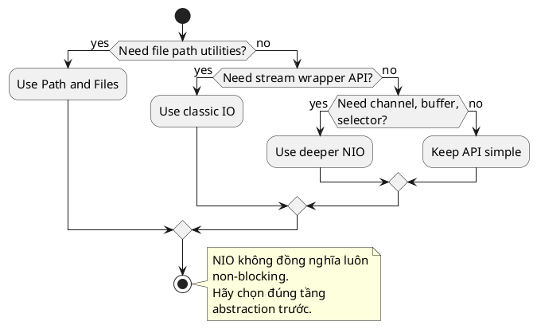

# NIO vs IO

## What is it

Classic IO trong `java.io` tập trung vào stream và reader style.

NIO trong `java.nio` đưa vào `Path`, `Files`, `Channel`, `Buffer`, selector và nhiều API hiện đại hơn.

Mental model:

- classic IO nhìn dữ liệu như dòng chảy stream
- NIO thêm góc nhìn path, buffer, channel, và các operation hiện đại hơn với filesystem

## How I used to misunderstand it

Mình từng nghĩ NIO chỉ là “IO version mới” nên luôn phải dùng NIO.

Thực tế, nhiều task đơn giản chỉ cần phần high-level của NIO như `Path` và `Files`.

`Channel`, `ByteBuffer`, hoặc selector chỉ đáng học sâu khi bạn chạm tới performance, file IO nâng cao, hoặc network IO đặc biệt.

Điểm dạy tốt nhất ở đây không phải “cái mới thay cái cũ”, mà là biết tầng nào đang giải quyết bài toán của mình.

## How it actually works

Classic IO thường dùng decorator như `InputStream`, `Reader`, `BufferedReader`.

NIO cung cấp `Path` thay cho path string thô, `Files` cho operation tiện dụng, `ByteBuffer` cho buffer rõ ràng, và `Channel` cho IO gần OS hơn.

NIO không tự động làm mọi thứ non-blocking. Non-blocking là một phần của NIO, không phải toàn bộ NIO.



### Comparison table

| Câu hỏi | Classic IO | NIO |
|---|---|---|
| Mô hình quen thuộc | stream, reader, writer | path, files, channel, buffer |
| File operation đơn giản | Dùng được, nhưng thường verbose hơn | `Path` và `Files` rất tiện |
| Text streaming | Rất quen thuộc | Thường vẫn kết hợp với reader |
| Non-blocking | Không phải trọng tâm | Có hỗ trợ ở một phần API |
| Bài toán phổ biến hiện đại | vẫn còn nhiều | thường là lựa chọn mặc định cho file path và utility |

### Quick workflow guide

```text
Need file path and file utilities? -> start with Path + Files
Need stream abstraction from an API? -> classic IO is still fine
Need advanced channel or selector behavior? -> look at NIO deeper
```

## Code example

```java
import java.nio.file.Files;
import java.nio.file.Path;

Path path = Path.of("notes.txt");
String fileName = path.getFileName().toString();
boolean markdown = fileName.endsWith(".md");
```

## When to use / when NOT to use

Dùng `Path` và `Files` cho phần lớn file tasks hiện đại.

Dùng classic stream hoặc reader khi API bạn tương tác yêu cầu stream, hoặc khi cần pipeline wrapper rõ ràng như `InputStreamReader`, `BufferedReader`, `BufferedInputStream`.

Không nhảy vào `Channel` hoặc `Selector` nếu chỉ đọc file nhỏ hoặc copy file đơn giản.

Không dùng path string thủ công cho logic path phức tạp nếu `Path` diễn đạt rõ hơn.

## How this connects to real Java projects

Spring hay dùng `Resource`, `MultipartFile`, hoặc abstraction riêng, nhưng phía dưới vẫn liên quan đến stream và file path.

Khi lưu upload, đọc config ngoài classpath, hoặc build batch job, `Path` và `Files` thường là lựa chọn đơn giản và an toàn hơn tự nối string path.

Trong khi đó, khi bạn đang xử lý upload stream hoặc download response, classic IO vẫn xuất hiện tự nhiên.

## Gotchas

- NIO không đồng nghĩa với non-blocking trong mọi API.
- `Path` behavior có thể phụ thuộc filesystem và OS.
- `Files.readAllBytes` hoặc `readString` không phù hợp với file rất lớn.
- Chỉ vì API ở package `java.nio` không có nghĩa là nó tự nhanh hơn mọi trường hợp.

## Handbook rule

- File task hiện đại default dùng `Path`/`Files`; chỉ rớt xuống stream/reader khi API yêu cầu.
- NIO không đồng nghĩa non-blocking; phải đọc API trước khi giả định.
- `Channel`/`Selector` chỉ dùng khi thực sự cần I/O multiplexing; tránh over-engineering cho file nhỏ.
- File rất lớn không dùng `Files.readAllBytes`/`readString`; stream từng phần.
- Path string thủ công cho logic phức tạp dễ sai OS; dùng `Path` để an toàn.

## Check yourself

- Vì sao `Path` và `Files` là điểm vào tốt hơn nhiều so với nhớ hết `Channel` ngay từ đầu?
- Khi nào classic IO vẫn là abstraction tự nhiên hơn NIO utility methods?
- Vì sao NIO không đồng nghĩa với non-blocking?
- Nếu bài toán là copy hoặc kiểm tra tồn tại của file, API nào thường là lựa chọn gọn nhất?
- Khi file rất lớn, vì sao `Files.readString` có thể là decision tệ?

## Exercises

### Bài 1: Normalize File Extension
Độ khó: Dễ

Đề bài:
Cho một file name, trả về extension của nó ở dạng lowercase không kèm dấu chấm, hoặc empty string nếu không có extension.

Ví dụ 1:
Đầu vào:
```text
fileName = "Report.CSV"
```

Đầu ra:
```text
"csv"
```

Giải thích:
Extension sau dấu chấm cuối cùng được normalize về lowercase.

Ràng buộc:
- fileName là non-null và không được blank
- fileName length <= 255
- Dấu chấm ở đầu không được tính là extension

### Bài 2: Choose Io Api
Độ khó: Trung bình

Đề bài:
Cho một task label, trả về `"files"` cho simple file operation và `"stream"` cho streaming operation. Các label `"read-small-text"`, `"copy-file"`, và `"check-exists"` dùng `"files"`; label `"process-large-upload"` dùng `"stream"`.

Ví dụ 1:
Đầu vào:
```text
task = "copy-file"
```

Đầu ra:
```text
"files"
```

Giải thích:
Simple file copy là use case phù hợp cho `Files`.

Ràng buộc:
- task là non-null
- Chỉ dùng các label đã được liệt kê
- Chỉ trả về `"files"` hoặc `"stream"`

### Bài 3: Count Path Segments
Độ khó: Trung bình

Đề bài:
Cho một relative path được ngăn cách bằng dấu gạch chéo, trả về số lượng path segment không rỗng mà nó có.

Ví dụ 1:
Đầu vào:
```text
path = "docs/java/io"
```

Đầu ra:
```text
3
```

Giải thích:
Path này có các segment `docs`, `java`, và `io`.

Ràng buộc:
- path là non-null
- path length <= 10000
- Các dấu slash liên tiếp không được tạo ra segment rỗng

## Links

- [[001-input-stream-vs-reader]]
- [[002-buffered-reader]]
- [[005-path-and-files]]
- Java I/O tutorial: https://docs.oracle.com/javase/tutorial/essential/io/
- `Path` Javadoc: https://docs.oracle.com/en/java/javase/21/docs/api/java.base/java/nio/file/Path.html
- `Files` Javadoc: https://docs.oracle.com/en/java/javase/21/docs/api/java.base/java/nio/file/Files.html
