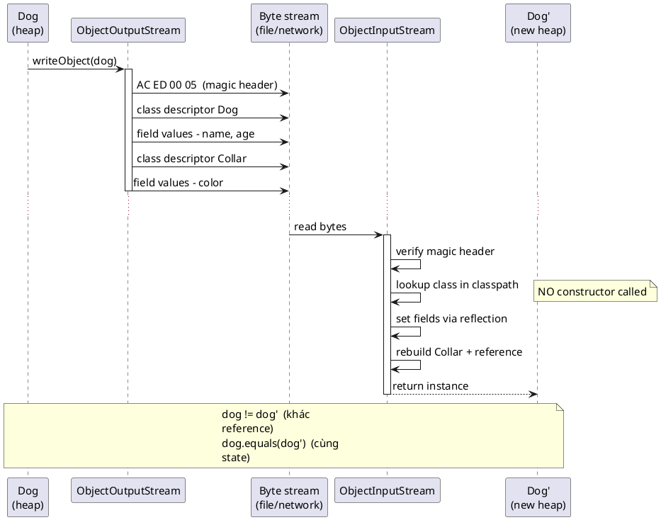

# Serialization

## What is it

Serialization là quá trình biến object thành dạng có thể lưu trữ hoặc truyền đi, rồi deserialize để dựng lại dữ liệu.

Trong Java core, `Serializable` là cơ chế built-in cũ.

Mental model: serialization không chỉ là “convert object thành bytes”, mà là contract về schema, version, compatibility và security.

## How I used to misunderstand it

Mình từng nghĩ chỉ cần `implements Serializable` là object có thể lưu và đọc lại an toàn.

Thực tế Java native serialization có nhiều rủi ro:

- format phụ thuộc class
- thay đổi field có thể phá compatibility
- deserialize dữ liệu không tin cậy có thể nguy hiểm

Vì vậy thứ đáng nhớ không phải chỉ là cú pháp, mà là cost dài hạn của contract này.

## How it actually works

Java serialization ghi metadata class và field state vào stream.

`serialVersionUID` dùng để kiểm tra compatibility khi deserialize.

Field `transient` không được serialize.

Với app hiện đại, JSON hoặc format có schema rõ thường dễ kiểm soát hơn cho API hoặc storage. Native Java serialization nên dùng rất thận trọng.

Ví dụ flow bên trong:



### Comparison table

| Câu hỏi                         | Native Java serialization | JSON hoặc schema-first format         |
| ------------------------------- | ------------------------- | ------------------------------------- |
| Gắn chặt với Java class         | Yes                       | Thường ít hơn                         |
| Dễ đọc ngoài Java               | No                        | Thường yes                            |
| Compatibility cần kỷ luật       | Rất cần                   | Vẫn cần, nhưng thường minh bạch hơn   |
| Deserialize input không tin cậy | Rủi ro cao                | Vẫn phải cẩn thận, nhưng mô hình khác |

### Serialization checklist

```text
Need long-term compatibility?
Need cross-language use?
Is the input trusted?
Do you really need native Java serialization at all?
```

## Code example

```java
import java.io.Serializable;

public class UserSession implements Serializable {
    private static final long serialVersionUID = 1L;

    private final String userId;
    private transient String accessToken;

    public UserSession(String userId, String accessToken) {
        this.userId = userId;
        this.accessToken = accessToken;
    }
}
```

## When to use / when NOT to use

Dùng serialization khi cần lưu hoặc truyền state theo format đã kiểm soát và hiểu rõ compatibility.

Với external API, ưu tiên JSON, Protobuf, Avro, hoặc format rõ schema hơn Java native serialization.

Không deserialize dữ liệu không tin cậy bằng native serialization.

Không serialize secret nếu không cần, và nhớ `transient` cho field nhạy cảm.

Nếu mục tiêu chỉ là lưu DTO để trao đổi giữa service và client, native Java serialization thường không phải lựa chọn đầu tiên.

## How this connects to real Java projects

Spring apps thường serialize và deserialize JSON qua Jackson, không dùng Java native serialization trực tiếp.

Tuy vậy concept serialization xuất hiện ở HTTP body, cache, session, messaging, Redis, Kafka, và DTO mapping.

Hiểu schema compatibility giúp tránh phá client khi đổi field, kể cả khi bạn không đụng tới `Serializable` hằng ngày.

## Gotchas

- Native Java deserialization từ input không tin cậy là rủi ro security nghiêm trọng.
- Quên `serialVersionUID` có thể gây lỗi compatibility khó hiểu khi class thay đổi.
- `transient` field sẽ mất giá trị sau deserialize.
- `implements Serializable` không tự biến design của bạn thành durable contract tốt.

## Handbook rule

- Không deserialize dữ liệu không tin cậy bằng Java native serialization; dùng JSON/Protobuf/Avro qua boundary external.
- Đánh dấu `transient` cho field nhạy cảm; secret không được vào snapshot.
- Khai báo `serialVersionUID` rõ để kiểm soát compatibility, không để compiler tự sinh.
- Schema phải có versioning rõ; native serialization là khoá vào JVM, không phải contract liên ngôn ngữ.
- DTO API/service-to-service ưu tiên format có schema, không Java serializable.

## Check yourself

- Vì sao `implements Serializable` chưa đủ để nói rằng object của bạn “an toàn để lưu lâu dài”?
- `serialVersionUID` đang bảo vệ điều gì?
- Khi nào một field nên là `transient`?
- Vì sao native Java serialization thường không phải lựa chọn đầu tiên cho public API?
- Input không tin cậy làm native deserialization nguy hiểm theo cách nào?

## Exercises

### Bài 1: Should Serialize Field
Độ khó: Dễ

Đề bài:
Cho một field name, trả về `false` cho các field nhạy cảm `"password"`, `"token"`, hoặc `"secret"`; ngược lại trả về `true`.

Ví dụ 1:
Đầu vào:
```text
fieldName = "token"
```

Đầu ra:
```text
false
```

Giải thích:
Token không nên bị serialize vào persisted state.

Ràng buộc:
- fieldName là non-null và không được blank
- Matching là case-sensitive
- Trả về một boolean

### Bài 2: Check Serial Version Compatibility
Độ khó: Trung bình

Đề bài:
Cho giá trị `serialVersionUID` đã lưu và giá trị hiện tại, trả về `true` nếu chúng bằng nhau.

Ví dụ 1:
Đầu vào:
```text
stored = 1, current = 2
```

Đầu ra:
```text
false
```

Giải thích:
Version ID khác nhau cho thấy serialized form không tương thích.

Ràng buộc:
- stored and current are positive numbers
- Equality là rule tương thích duy nhất trong bài này
- Trả về boolean

### Bài 3: Mark Transient Fields
Độ khó: Trung bình

Đề bài:
Cho các field name, trả về một list chỉ chứa những name nên được đánh dấu là transient: `"password"`, `"token"`, và `"secret"`.

Ví dụ 1:
Đầu vào:
```text
fields = ["id", "token", "name"]
```

Đầu ra:
```text
["token"]
```

Giải thích:
Theo rule này thì chỉ có `token` là sensitive.

Ràng buộc:
- fields là non-null
- 0 <= fields.length <= 100000
- Giữ nguyên encounter order

## Links

- [[001-input-stream-vs-reader]]
- [[003-nio-vs-io]]
- [[005-path-and-files]]
- Java serialization spec overview: https://docs.oracle.com/en/java/javase/21/docs/specs/serialization/serial-arch.html
- `Serializable` Javadoc: https://docs.oracle.com/en/java/javase/21/docs/api/java.base/java/io/Serializable.html
