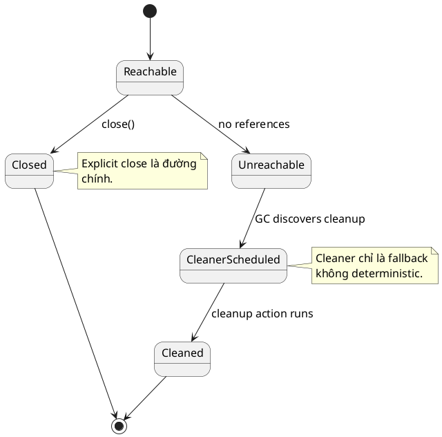

# finalize() and Cleaner

## What is it

`finalize()` là hook cũ cho phép JVM gọi cleanup logic trước khi object bị thu gom.

`Cleaner` là API mới hơn để đăng ký cleanup action chạy sau khi object trở thành phantom reachable.

Cả hai đều liên quan tới **cleanup không xác định thời điểm**, nên không thay thế cho explicit resource management như `close()` hoặc `try-with-resources`.

## How I used to misunderstand it

Mình từng nghĩ cứ viết cleanup vào `finalize()` là JVM sẽ tự dọn đúng lúc.

Thực tế thời điểm chạy là non-deterministic. Nó có thể rất muộn, hoặc không kịp trước khi process chịu áp lực tài nguyên. Vì thế dựa vào `finalize()` cho file handle, socket, native memory, hoặc DB resource là ý tưởng rất tệ.

## How it actually works

`finalize()` có nhiều vấn đề:

- thời điểm chạy khó đoán
- ảnh hưởng GC
- có thể làm object sống lâu hơn cần thiết
- đã bị deprecated for removal trong JDK hiện đại

`Cleaner` tốt hơn vì tách cleanup action ra khỏi object và tránh nhiều vấn đề thiết kế của finalization. Nhưng nó vẫn **không deterministic**.



### So sánh nhanh

| Cơ chế | Khi nào chạy | Có nên là đường chính không |
|---|---|---|
| `try-with-resources` / `close()` | khi bạn đóng rõ ràng | có |
| `Cleaner` | khi GC thấy object đủ điều kiện | không |
| `finalize()` | cũ, khó đoán, deprecated | không |

### Mental model nên nhớ

```text
Main path: explicit close
Fallback: Cleaner if really needed
Never rely on: finalize for new code
```

Nói cách khác, `Cleaner` là lưới an toàn cuối cùng, không phải chiến lược lifecycle chính.

## Code example

```java
import java.lang.ref.Cleaner;

final class NativeBuffer implements AutoCloseable {
    private static final Cleaner CLEANER = Cleaner.create();

    private final Cleaner.Cleanable cleanable;

    NativeBuffer() {
        this.cleanable = CLEANER.register(this, () -> System.out.println("cleanup fallback"));
    }

    @Override
    public void close() {
        cleanable.clean();
    }
}
```

Điểm quan trọng trong ví dụ là `close()` vẫn là đường chính. Cleaner chỉ đóng vai fallback nếu caller quên cleanup.

## When to use / when NOT to use

Use `Cleaner` như fallback cho external resource khó kiểm soát hoàn toàn, nhất là khi vẫn có `close()` rõ ràng ở đường chính.

Không dùng `finalize()` cho code mới.

Không dùng `Cleaner` để thay thế `try-with-resources` cho resource có vòng đời ngắn và cần release đúng lúc.

## How this connects to real Java projects

Trong Spring app, cleanup chuẩn thường đi qua `@PreDestroy`, `DisposableBean`, `close()` method, lifecycle của bean container, hoặc lifecycle của connection pool.

Nếu code phụ thuộc vào `finalize()` hoặc `Cleaner` để giải phóng resource chính, shutdown behavior và memory pressure sẽ khó đoán hơn rất nhiều.

## Gotchas

- `finalize()` không đảm bảo chạy đúng lúc, thậm chí có thể không chạy trước khi process kết thúc.
- `Cleaner` cũng không deterministic.
- Cleanup fallback không sửa được ownership design kém.
- Nếu resource phải release ngay, chỉ cleanup explicit mới đáng tin.

## Handbook rule

- Không dùng `finalize()` trong code mới; coi như deprecated.
- Resource có vòng đời rõ phải dùng `try-with-resources`/`AutoCloseable`, không dựa vào finalizer/cleaner.
- `Cleaner` chỉ là fallback an toàn cho resource external khó kiểm soát.
- Cleanup không deterministic; không thiết kế logic phụ thuộc thời điểm chạy của cleaner.
- Nếu phải release ngay, ownership phải nằm ở caller có lifecycle rõ ràng.

## Check yourself

- Vì sao `finalize()` không phù hợp cho resource phải giải phóng đúng lúc?
- `Cleaner` tốt hơn `finalize()` ở điểm nào, và vẫn yếu ở điểm nào?
- Vì sao `close()` hoặc `try-with-resources` vẫn là đường chính?
- Khi nào một fallback như `Cleaner` có giá trị thực tế?
- Trong Spring, lifecycle hook nào thường đáng tin hơn finalization?

## Exercises

### Bài 1: Choose Cleanup Mechanism

Độ khó: Dễ

Đề bài:
Cho biết một resource có cần deterministic release hay không và nó có sở hữu external resource hay không, trả về một trong ba string `"try-with-resources"`, `"cleaner"`, hoặc `"none"`, biểu diễn lựa chọn mặc định tốt nhất.

Ví dụ 1:

Đầu vào:
```text
requiresDeterministicRelease = true, ownsExternalResource = true
```

Đầu ra:
```text
try-with-resources
```

Giải thích:
Deterministic release nên ưu tiên explicit resource management.

Ràng buộc:

- Input là các giá trị boolean
- Chỉ trả về đúng một trong ba output string đã nêu
- Ưu tiên lựa chọn explicit an toàn nhất khi deterministic release là bắt buộc

### Bài 2: Count Outstanding Resources

Độ khó: Trung bình

Đề bài:
Cho hai integer array song song `opened` và `closed`, trong đó index `i` mô tả một request, trả về tổng số resource vẫn còn outstanding sau khi cộng dồn tất cả request.

Ví dụ 1:

Đầu vào:
```text
opened = [3, 2, 1]
closed = [3, 1, 1]
```

Đầu ra:
```text
1
```

Giải thích:
Chỉ còn một resource chưa được đóng trên toàn bộ request.

Ràng buộc:

- `opened` and `closed` are non-null
- `opened.length == closed.length`
- `0 <= opened[i], closed[i] <= 100000`

### Bài 3: Should Register Cleaner Fallback

Độ khó: Trung bình

Đề bài:
Cho biết một object có sở hữu external resource hay không và nó đã có explicit `close()` method hay chưa, trả về `true` nếu việc đăng ký `Cleaner` fallback là hợp lý.

Ví dụ 1:

Đầu vào:
```text
ownsExternalResource = true, hasExplicitCloseMethod = true
```

Đầu ra:
```text
true
```

Giải thích:
External resource có thể khiến cleanup safety net trở nên hợp lý, ngay cả khi explicit close vẫn là đường chính.

Ràng buộc:

- Input là các giá trị boolean
- Chỉ trả về `true` khi fallback thực sự đem lại practical value
- Heap-only object không nên cần cleaner registration

## Links

- [[003-clone-and-Cloneable]]
- [[../Exception/003-try-with-resources]]
- [[../Memory/001-GC]]
- [[../Memory/005-strong-soft-weak-phantom-reference]]
- `Cleaner` Javadoc: https://docs.oracle.com/en/java/javase/21/docs/api/java.base/java/lang/ref/Cleaner.html
- JEP 421, Deprecate Finalization for Removal: https://openjdk.org/jeps/421
