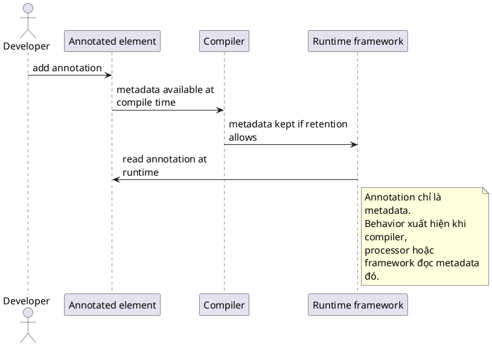

# Annotation

## What is it

`Annotation` là `metadata` gắn lên class, method, field, parameter, package, hoặc type use để compiler, framework, và tool có thể đọc thêm ý nghĩa của code theo cách machine-readable.

Nó giải quyết bài toán diễn đạt `intent` mà comment thường không đủ. Comment chỉ cho người đọc xem. Annotation thì đi vào program model.

## How I used to misunderstand it

Hiểu nhầm phổ biến là xem annotation như comment đẹp hơn.

Sai khác lớn nhất là comment không có hiệu lực với compiler hay framework, còn annotation có thể được compiler kiểm tra, ghi vào class file, và để runtime framework đọc lại nếu retention cho phép.

## How it actually works

Một annotation type được khai báo bằng `@interface`. Khi bạn gắn annotation lên code, compiler xử lý nó như một dạng metadata có cấu trúc.

Điểm quan trọng nhất là annotation bản thân nó không tự chạy logic. Nó chỉ phát tín hiệu. Hành vi thật chỉ xuất hiện khi có một bên khác đọc tín hiệu đó.

### Metadata timeline

| Retention | Metadata còn ở đâu | Reflection runtime có đọc được không | Thường dùng cho |
|---|---|---|---|
| `SOURCE` | Chỉ lúc compile source | Không | compiler check, lint, processor style rule |
| `CLASS` | Trong bytecode | Không qua reflection thường | tooling, bytecode-level use case |
| `RUNTIME` | Trong bytecode và runtime model | Có | framework như Spring, Jackson, validation |

### Compile-time vs runtime boundary

```text
Annotation        = metadata
Compiler/Tool     = có thể đọc ở compile time
Reflection        = chỉ đọc được annotation retention RUNTIME
Framework runtime = phản ứng theo metadata đã đọc
```

Vì vậy, annotation nên được hiểu là `metadata`, không phải `behavior`. Behavior luôn nằm ở consumer của annotation.



## Code example

```java
@Deprecated
class LegacyFormatter {
    String format(String text) {
        return text.trim();
    }
}
```

`@Deprecated` không đổi logic của method. Nó chỉ thêm metadata để compiler và IDE cảnh báo rằng API này không còn nên dùng cho code mới.

## When to use / when NOT to use

Dùng annotation khi cần mô tả role, lifecycle, validation hint, mapping rule, configuration hint, hoặc contract mà nhiều tool có thể cùng đọc.

Đừng dùng annotation để giấu business rule phức tạp sau một marker mơ hồ. Nếu ý nghĩa chính nằm ở control flow hoặc object collaboration, code thường hoặc object model thường sẽ rõ hơn.

### Quick comparison

| Câu hỏi | Annotation giúp gì |
|---|---|
| “Code này mang ý nghĩa gì cho framework?” | Gắn metadata trực tiếp lên element |
| “Khi nào logic thật sự chạy?” | Khi compiler, processor, reflection, hoặc framework đọc metadata |
| “Annotation tự làm gì không?” | Không, nó không tự chạy |

## How this connects to real Java projects

Spring dựa mạnh vào annotation như `@Component`, `@Service`, `@Configuration`, `@Bean`, `@Transactional`, `@Autowired`, `@RequestMapping`.

Các annotation này không tự tạo bean hay mở transaction. Spring container đọc metadata đó, rồi ở runtime mới quyết định inject dependency, wrap proxy, map route, hoặc quản lý lifecycle.

## Gotchas

- `@Retention` quyết định compiler, bytecode, hay runtime còn nhìn thấy annotation tới mức nào.
- Hai annotation trùng tên nhưng khác package là hai type hoàn toàn khác nhau.
- Annotation không nên thay thế naming rõ ràng hoặc thiết kế class tốt.
- Lạm dụng annotation có thể làm rule bị rải rác và khó trace luồng xử lý thật.
- `RUNTIME` retention tiện cho framework, nhưng cũng có nghĩa là runtime behavior bắt đầu phụ thuộc vào metadata này.

## Handbook rule

- Annotation chỉ là metadata; logic thực vẫn phải có consumer (compiler/processor/framework).
- Chọn `@Retention` đúng nhu cầu: `SOURCE`/`CLASS`/`RUNTIME`; chọn `RUNTIME` chỉ khi reflection cần.
- Hai annotation cùng tên khác package là hai type khác nhau; tránh import nhầm.
- Annotation không thay thế naming và class design tốt; đừng giấu logic sau marker.
- Rải annotation khắp codebase mà không có consumer trung tâm là tín hiệu over-use.

## Check yourself

- Vì sao annotation được gọi là metadata chứ không phải behavior?
- `SOURCE`, `CLASS`, và `RUNTIME` khác nhau ở đâu nếu nhìn từ góc độ ai có thể đọc chúng?
- Vì sao một annotation có thể rất quan trọng với Spring nhưng vẫn không tự chạy logic nào?
- Nếu một rule chỉ có ý nghĩa lúc compile, vì sao `RUNTIME` có thể là retention quá mạnh?
- Comment và annotation khác nhau thế nào về khả năng được tool xử lý?

## Exercises

### Bài 1: Resolve Annotation Visibility

Độ khó: Dễ

Đề bài:
Cho một retention label, chỉ trả về `"reflection-visible"` cho `"RUNTIME"`. Trả về `"bytecode-only"` cho `"CLASS"`, và `"source-only"` cho `"SOURCE"`.

Ví dụ 1:

Đầu vào:
```text
retention = "RUNTIME"
```

Đầu ra:
```text
"reflection-visible"
```

Giải thích:
Chỉ các annotation có retention là runtime mới đọc được qua reflection.

Ràng buộc:

- `retention` là non-null
- `retention` là một trong `SOURCE`, `CLASS`, `RUNTIME`
- Việc matching có phân biệt chữ hoa chữ thường

### Bài 2: Filter Runtime Visible Annotations

Độ khó: Trung bình

Đề bài:
Cho các array `annotationNames` và `retentions` theo cùng một thứ tự, trả về một list chỉ chứa annotation name có retention là `"RUNTIME"`.

Ví dụ 1:

Đầu vào:
```text
annotationNames = ["Component", "Override", "MyMarker"]
retentions = ["RUNTIME", "SOURCE", "CLASS"]
```

Đầu ra:
```text
["Component"]
```

Giải thích:
Chỉ có `Component` còn visible với reflection.

Ràng buộc:

- Cả hai array đều là non-null
- Cả hai array có cùng độ dài
- Trả về các name theo đúng thứ tự ban đầu

### Bài 3: Count Direct Annotation Matches

Độ khó: Trung bình

Đề bài:
Cho một array các annotation name đang hiện diện và một target annotation name, trả về số direct match tồn tại.

Ví dụ 1:

Đầu vào:
```text
presentAnnotations = ["Bean", "Primary", "Bean"], targetAnnotation = "Bean"
```

Đầu ra:
```text
2
```

Giải thích:
Target annotation xuất hiện hai lần trong list đã cho.

Ràng buộc:

- `presentAnnotations` là non-null
- `targetAnnotation` là non-null
- Độ dài array nằm trong khoảng từ 0 đến 100000

## Links

- [[001-Reflection]]
- [[003-Custom-Annotation]]
- [[005-annotation-processor]]
- Java annotation package summary: https://docs.oracle.com/en/java/javase/21/docs/api/java.base/java/lang/annotation/package-summary.html
- `Retention` Javadoc: https://docs.oracle.com/en/java/javase/21/docs/api/java.base/java/lang/annotation/Retention.html
- `Target` Javadoc: https://docs.oracle.com/en/java/javase/21/docs/api/java.base/java/lang/annotation/Target.html
- JLS 9.6 Annotations: https://docs.oracle.com/javase/specs/jls/se21/html/jls-9.html#jls-9.6
- Spring classpath scanning: https://docs.spring.io/spring-framework/reference/core/beans/classpath-scanning.html
