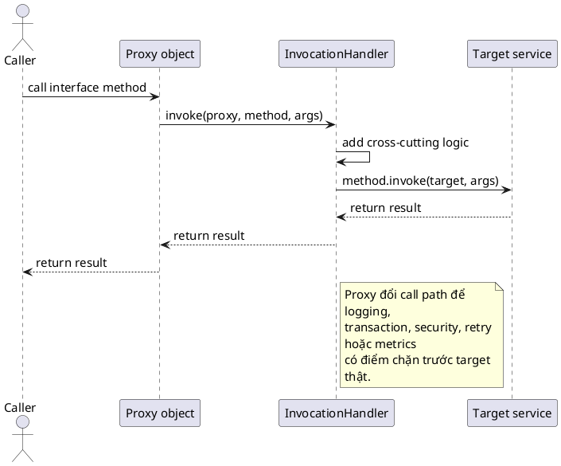

# Dynamic Proxy

## What is it

`Dynamic proxy` là cơ chế tạo object trung gian ở runtime để chặn lời gọi method rồi thêm logic trước hoặc sau khi chuyển tiếp sang target thật.

Nó giải quyết bài toán `cross-cutting concern`, ví dụ logging, transaction, security, retry, metrics, mà không phải chép cùng một đoạn hạ tầng vào từng service class.

## How I used to misunderstand it

Mình từng nghĩ proxy chỉ là “ma thuật framework”.

Thực ra proxy là một lớp bọc có chủ đích. Điều quan trọng không phải là nó bí ẩn, mà là nó đổi call path để hạ tầng có điểm chặn trước khi business method chạy.

## How it actually works

JDK `Proxy` API tạo một object implement cùng interface với target. Khi caller gọi method trên proxy, lời gọi không đi thẳng vào target mà đi qua `InvocationHandler`.

### Call flow



```text
Without proxy: caller -> target.method()
With proxy:    caller -> proxy -> InvocationHandler -> target.method()
```

Trong handler, bạn nhận được:

- `proxy`, là object proxy hiện tại
- `method`, là metadata của method đang được gọi
- `args`, là argument runtime

Từ đó handler có thể log, check permission, mở transaction, đo thời gian, rồi mới gọi `method.invoke(target, args)`.

### Proxy không phải reflection y hệt

`Dynamic proxy` có dùng reflection ở phần invoke, nhưng mental model chính của nó là `interception`, không phải metadata discovery.

| Cơ chế | Câu hỏi chính | Trọng tâm |
|---|---|---|
| Reflection | “Class này có gì?” hoặc “Có thể gọi gì động?” | Metadata và dynamic invocation |
| Dynamic proxy | “Có thể chặn lời gọi method ở giữa không?” | Interception và wrapping behavior |

### Boundary cần nhớ

JDK dynamic proxy hoạt động dựa trên `interface`. Nếu target chỉ có concrete class mà không có interface, framework thường phải chuyển sang subclass-based proxy hoặc bytecode generation.

## Code example

```java
import java.lang.reflect.InvocationHandler;
import java.lang.reflect.Method;
import java.lang.reflect.Proxy;

interface GreetingService {
    String hello(String name);
}

GreetingService target = name -> "Hello " + name;

InvocationHandler handler = (proxy, method, args) -> {
    System.out.println("Calling: " + method.getName());
    return method.invoke(target, args);
};

GreetingService proxy = (GreetingService) Proxy.newProxyInstance(
        GreetingService.class.getClassLoader(),
        new Class<?>[] {GreetingService.class},
        handler
);
```

Ở đây behavior mới không nằm trong `GreetingService` gốc. Nó nằm ở lớp bọc runtime là proxy và ở `InvocationHandler`.

## When to use / when NOT to use

Dùng dynamic proxy khi nhiều interface method cần đi qua cùng một rule chung như logging, authorization, metrics, retry, transaction boundary.

Đừng dùng dynamic proxy cho business rule chỉ tồn tại ở một class duy nhất, hoặc khi target không có interface và subclass proxy cũng không phù hợp. Nếu chỉ cần bọc một hành vi nhỏ, decorator viết tay hoặc code thường có thể dễ đọc hơn.

### Fit check

| Tình huống | Dynamic proxy có hợp không | Vì sao |
|---|---|---|
| Cần chặn mọi call vào service interface | Có | Đúng kiểu interception point |
| Cần thêm metrics cho nhiều method giống nhau | Có | Tránh lặp logic hạ tầng |
| Chỉ muốn sửa logic của một method cụ thể | Thường không | Code thường hoặc refactor target rõ hơn |
| Target không có interface | Không phải JDK proxy chuẩn | Phải dùng kỹ thuật khác |

## How this connects to real Java projects

Spring AOP, `@Transactional`, và nhiều infrastructure feature dựa trên proxy.

Khi bean được inject qua interface, caller rất có thể đang nói chuyện với proxy chứ không phải object thật. Vì vậy mới có những hiện tượng khó hiểu lúc đầu, ví dụ self-invocation không đi qua advice vì lời gọi đó không đi qua proxy layer.

## Gotchas

- JDK dynamic proxy không proxy trực tiếp class thường nếu không có interface.
- Gọi method từ bên trong chính bean đó có thể bỏ qua proxy của Spring.
- `equals`, `hashCode`, và `toString` trên proxy có thể cần xử lý cẩn thận.
- Stack trace và debug flow dài hơn vì có thêm tầng trung gian.
- Proxy thêm behavior ở runtime, nên đọc code tĩnh thôi đôi khi chưa thấy hết chuyện gì đang xảy ra.

## Handbook rule

- Dynamic proxy hợp khi nhiều interface method cần cùng cross-cutting rule (log/auth/metrics/retry).
- Không có interface và không subclass proxy được thì viết decorator/explicit code thay vì proxy.
- Self-invocation trong cùng bean bypass proxy của Spring; gọi qua bean injected khi cần.
- `equals`/`hashCode`/`toString` trên proxy phải xử lý cẩn thận, không kế thừa hành vi mặc định bừa.
- Proxy thêm behavior runtime; debug và stack trace dài hơn, cần đọc code đầy đủ.

## Check yourself

- Dynamic proxy khác reflection thuần ở mục tiêu chính như thế nào?
- Vì sao JDK proxy gắn chặt với interface?
- Khi nào proxy là cách tốt để tách concern hạ tầng khỏi business logic?
- Vì sao self-invocation trong Spring thường làm người mới học ngạc nhiên?
- Nếu caller đang nói chuyện với proxy, điều đó ảnh hưởng gì tới debug và stack trace?

## Exercises

### Bài 1: Should Use Dynamic Proxy

Độ khó: Dễ

Đề bài:
Cho các boolean `interfaceBased`, `finalClass`, và `needsCrossCuttingConcern`, chỉ trả về `true` khi `interfaceBased` và `needsCrossCuttingConcern` là `true`. Trong bài này, `finalClass` chỉ được cung cấp để lấy context và không làm thay đổi quyết định cho interface-based JDK proxy.

Ví dụ 1:

Đầu vào:
```text
interfaceBased = true, finalClass = false, needsCrossCuttingConcern = true
```

Đầu ra:
```text
true
```

Giải thích:
Đây là case phù hợp cho interface-based JDK proxy.

Ràng buộc:

- Tất cả input đều là boolean
- Trả về một boolean
- Không inspect các framework-specific type hoặc áp thêm rule của subclass-based proxy

### Bài 2: Count Intercepted Calls

Độ khó: Dễ

Đề bài:
Cho các array `methodNames` và `skipInterception` theo cùng một thứ tự, đếm xem có bao nhiêu lời gọi nên bị intercept. Một lời gọi chỉ bị intercept khi `skipInterception[i]` là `false`.

Ví dụ 1:

Đầu vào:
```text
methodNames = ["toString", "save", "delete"]
skipInterception = [true, false, false]
```

Đầu ra:
```text
2
```

Giải thích:
Chỉ có `save` và `delete` đi qua advice trong mô hình đơn giản này.

Ràng buộc:

- Cả hai array đều là non-null
- Cả hai array có cùng độ dài
- Độ dài array nằm trong khoảng từ 0 đến 100000

### Bài 3: Build Invocation Summary

Độ khó: Trung bình

Đề bài:
Cho `methodName`, `argumentCount`, và `success`, trả về summary string theo đúng format `"<methodName>#<argumentCount>:SUCCESS"` khi `success` là `true`, ngược lại là `"<methodName>#<argumentCount>:FAIL"`.

Ví dụ 1:

Đầu vào:
```text
methodName = "save", argumentCount = 2, success = true
```

Đầu ra:
```text
"save#2:SUCCESS"
```

Giải thích:
Summary này mô hình hóa kiểu log line mà invocation handler có thể emit.

Ràng buộc:

- `methodName` là non-null
- `argumentCount` nằm trong khoảng từ 0 đến 1000
- Format của summary phải khớp chính xác

## Links

- [[001-Reflection]]
- [[003-Custom-Annotation]]
- Java `Proxy` Javadoc: https://docs.oracle.com/en/java/javase/21/docs/api/java.base/java/lang/reflect/Proxy.html
- `InvocationHandler` Javadoc: https://docs.oracle.com/en/java/javase/21/docs/api/java.base/java/lang/reflect/InvocationHandler.html
- Spring AOP proxying: https://docs.spring.io/spring-framework/reference/core/aop/proxying.html
- Spring declarative transactions: https://docs.spring.io/spring-framework/reference/data-access/transaction/declarative.html
