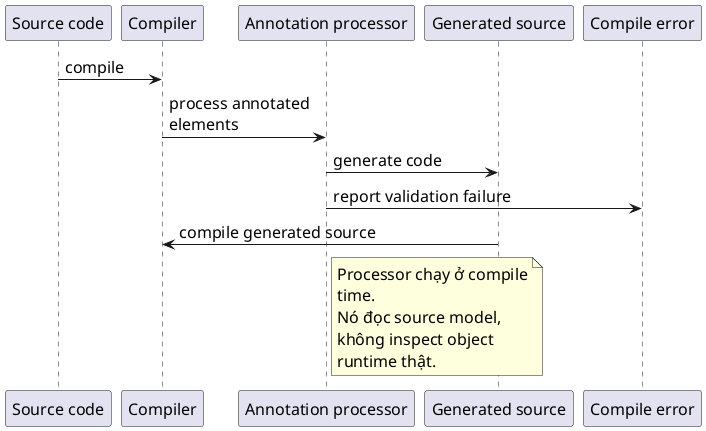

# Annotation Processor

## What is it

`Annotation processor` là cơ chế chạy ở `compile time` để đọc annotation, validate contract, generate source code, hoặc báo compile error trước khi application chạy.

Nó giải quyết bài toán làm sớm hai việc mà runtime thường làm muộn hơn: kiểm tra metadata và sinh boilerplate.

## How I used to misunderstand it

Mình từng nghĩ annotation processor chỉ là một biến thể khác của reflection.

Sai ở chỗ reflection đọc runtime model của class đã được load, còn annotation processor đọc source model do compiler cung cấp trong lúc compile. Nó không có object runtime thật để gọi method hay inspect state đang chạy.

## How it actually works

Annotation processor thường extend `AbstractProcessor` và được compiler gọi theo nhiều `round`.



Trong mỗi round, processor có thể:

- xem annotation nào đang xuất hiện
- duyệt `Element` được annotate
- đọc type information qua `TypeMirror`
- generate source file mới
- báo lỗi hoặc warning qua `Messager`

### Tiny pipeline

```text
source code
   -> compiler discovers annotations
   -> processor reads source model
   -> processor validates or generates code
   -> compiler continues with generated sources if needed
```

### Reflection vs processor

| Câu hỏi | Reflection | Annotation processor |
|---|---|---|
| Chạy lúc nào | Runtime | Compile time |
| Đọc cái gì | Class metadata của code đã load | Source model, elements, types |
| Có object runtime thật không | Có thể có | Không |
| Hợp cho | Framework runtime, scanners, dynamic invocation | Code generation, compile-time validation |

Mental model ngắn gọn là processor là một compiler plugin hẹp, tập trung vào annotation. Nó không chạy business method thật. Nó đọc model của source code để generate hoặc fail fast sớm hơn runtime.

## Code example

```java
import java.util.Set;
import javax.annotation.processing.AbstractProcessor;
import javax.annotation.processing.RoundEnvironment;
import javax.lang.model.element.TypeElement;

public final class DemoProcessor extends AbstractProcessor {
    @Override
    public boolean process(Set<? extends TypeElement> annotations, RoundEnvironment roundEnv) {
        return false;
    }
}
```

Đây mới là entry point. Giá trị thật của processor nằm ở phần đọc `roundEnv`, phân tích `Element`, rồi generate code hoặc báo lỗi có ích cho người dùng thư viện.

## When to use / when NOT to use

Dùng annotation processor khi muốn generate code hoặc fail fast ở compile time, ví dụ tạo mapper, registry, adapter class, hoặc kiểm tra missing metadata trước khi app start.

Đừng dùng annotation processor cho rule phụ thuộc dữ liệu runtime, database, network, hoặc state chỉ xuất hiện khi application đang chạy. Nếu thông tin chưa tồn tại ở compile time, processor không có cách đọc được nó.

### Good fit checklist

| Nhu cầu | Processor có hợp không | Vì sao |
|---|---|---|
| Sinh source code có cấu trúc lặp lại | Có | Compile-time generation là thế mạnh |
| Báo lỗi nếu thiếu annotation bắt buộc | Có | Fail sớm trước runtime |
| Gọi API thật để quyết định logic | Không | Không có runtime object hay runtime environment |
| Đọc bean state sau khi Spring start | Không | Lúc này compile đã xong |

## How this connects to real Java projects

Spring core truyền thống dựa nhiều vào runtime reflection và proxy.

Nhưng ecosystem Java rộng hơn dùng annotation processor trong các thư viện như MapStruct, AutoService, Dagger, và một phần Lombok. Hiểu processor giúp mình phân biệt rõ phần nào được sinh hoặc validate ở compile time, và phần nào chỉ được phát hiện khi runtime framework scan class.

## Gotchas

- Processor không có object runtime để invoke method thật.
- Generate sai package hoặc class name có thể làm compile fail dây chuyền.
- Một số processor cần nhiều round, không phải mọi symbol đều xuất hiện ngay round đầu.
- Generated code cũng là code production, đừng xem nó như thứ “vô hình”.
- Nếu error message của processor mơ hồ, người dùng thư viện sẽ rất khó sửa.

## Handbook rule

- Annotation processor cho compile-time concern: code generation và validation; không cho runtime data.
- Generate đúng package/class name; sai một chỗ có thể vỡ dây chuyền compile.
- Error message phải rõ và actionable cho người dùng thư viện.
- Hỗ trợ nhiều round nếu symbol chưa xuất hiện ngay; xử lý incremental compile cẩn thận.
- Generated code vẫn là code production; cần test, format, và documentation đầy đủ.

## Check yourself

- Vì sao annotation processor không thể thay reflection cho mọi trường hợp sử dụng?
- Nếu một rule phụ thuộc database hoặc config runtime, vì sao processor không xử lý đúng được?
- `round` trong processing gợi ý điều gì về việc code generate có thể xuất hiện dần dần?
- Vì sao generated code nên được đọc và debug như code bình thường?
- Trong hệ sinh thái Spring, phân biệt compile time với runtime giúp tránh hiểu nhầm nào?

## Exercises

### Bài 1: Build Generated Class Name

Độ khó: Dễ

Đề bài:
Cho `sourceType` và `suffix`, trả về generated class name bằng cách nối trực tiếp hai phần này.

Ví dụ 1:

Đầu vào:
```text
sourceType = "UserMapper", suffix = "Impl"
```

Đầu ra:
```text
"UserMapperImpl"
```

Giải thích:
Nhiều processor tạo ra class name có thể dự đoán được từ source type cộng với suffix.

Ràng buộc:

- Cả hai input đều là non-null
- Độ dài của mỗi input nằm trong khoảng từ 0 đến 200
- Trả về đúng kết quả nối trực tiếp

### Bài 2: Count Supported Annotated Types

Độ khó: Dễ

Đề bài:
Cho các array `typeNames` và `hasSupportedAnnotation` theo cùng một thứ tự, trả về số lượng type nên được process. Một type chỉ nên được process khi `hasSupportedAnnotation[i]` là `true`.

Ví dụ 1:

Đầu vào:
```text
typeNames = ["User", "Order", "AuditLog"]
hasSupportedAnnotation = [true, false, true]
```

Đầu ra:
```text
2
```

Giải thích:
Chỉ có `User` và `AuditLog` khớp input filter của processor.

Ràng buộc:

- Cả hai array đều là non-null
- Cả hai array có cùng độ dài
- Độ dài array nằm trong khoảng từ 0 đến 100000

### Bài 3: Find First Missing Required Annotation

Độ khó: Trung bình

Đề bài:
Cho các array `fieldNames` và `hasRequiredAnnotation` theo cùng một thứ tự, trả về field name đầu tiên có annotation flag là `false`. Trả về chuỗi rỗng `""` khi mọi field đều hợp lệ.

Ví dụ 1:

Đầu vào:
```text
fieldNames = ["id", "email", "status"]
hasRequiredAnnotation = [true, false, true]
```

Đầu ra:
```text
"email"
```

Giải thích:
Processor nên báo field đầu tiên bị thiếu required annotation.

Ràng buộc:

- Cả hai array đều là non-null
- Cả hai array có cùng độ dài
- Trả về chuỗi rỗng khi mọi field đều hợp lệ

## Links

- [[001-Reflection]]
- [[002-Annotation]]
- [[003-Custom-Annotation]]
- Java annotation processing package summary: https://docs.oracle.com/en/java/javase/21/docs/api/java.compiler/javax/annotation/processing/package-summary.html
- `AbstractProcessor` Javadoc: https://docs.oracle.com/en/java/javase/21/docs/api/java.compiler/javax/annotation/processing/AbstractProcessor.html
- `RoundEnvironment` Javadoc: https://docs.oracle.com/en/java/javase/21/docs/api/java.compiler/javax/annotation/processing/RoundEnvironment.html
- Language model API: https://docs.oracle.com/en/java/javase/21/docs/api/java.compiler/javax/lang/model/element/package-summary.html
- JSR 269 overview: https://jcp.org/en/jsr/detail?id=269
