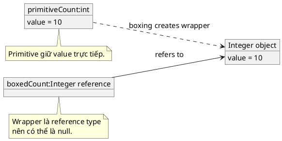

# Primitive vs Wrapper

## What is it

Java có hai nhóm type nhìn khá giống nhau nhưng semantics khác hẳn:

* primitive type như `int`, `long`, `double`, `boolean`
* wrapper type như `Integer`, `Long`, `Double`, `Boolean`

Mental model ngắn gọn:

* primitive là value trực tiếp
* wrapper là object bao quanh value đó

Primitive thường gọn hơn, rẻ hơn, và không thể là `null`. Wrapper có method tiện ích, làm việc được với generic API, nhưng kéo theo `null`, identity, và object overhead.

## How I used to misunderstand it

Mình từng nghĩ `int` và `Integer` gần như là một, chỉ khác style viết. Cảm giác đó càng mạnh khi autoboxing làm code trông rất mượt.

Vấn đề là chỉ cần đổi từ `int` sang `Integer`, code đã bước từ world của value sang world của object. Từ đó xuất hiện thêm `null`, `NullPointerException` khi unbox, reference identity, và allocation cost.

## How it actually works

Primitive lưu value trực tiếp theo type system của Java. Wrapper là reference type trỏ tới object. JVM hỗ trợ autoboxing và unboxing để chuyển qua lại giữa hai bên:



```java
// boxing
Integer x = 10;
// unboxing
int y = x;
```

Cú pháp này tiện, nhưng không có nghĩa hai loại là một.

Điểm quan trọng nhất là wrapper có thể là `null`, còn primitive thì không. Vì vậy đoạn code nhìn vô hại như `int total = value;` có thể ném `NullPointerException` nếu `value` là `Integer` đang `null`.

Wrapper còn có object identity. Hai `Integer` có cùng số chưa chắc là cùng object. Vì vậy `==` trên wrapper rất dễ gây hiểu lầm. Khi cần so sánh logical value, hãy dùng `.equals()` hoặc unbox rõ ràng khi biết chắc không `null`.

### Quick comparison table

| Question | Primitive | Wrapper |
|---|---|---|
| Ví dụ | `int` | `Integer` |
| Có thể là `null` không | Không | Có |
| Có method không | Không | Có |
| Dùng trực tiếp với generics không | Không | Có |
| So sánh value bằng `==` có ổn không | Có, với cùng primitive type phù hợp | Không nên dựa vào |
| Có risk unboxing NPE không | Không | Có |
| Thường hợp với hot path số lượng lớn không | Có | Thường kém hơn |

### Tiny decision scaffold

```text
Need null or generic API? -> Wrapper
Need arithmetic, tight loops, simple counters? -> Primitive
```

## Code example

```java
int primitiveCount = 10;
// autoboxing
Integer boxedCount = primitiveCount;

Integer nullableCount = null;

System.out.println(primitiveCount + 5); // 15
System.out.println(boxedCount.equals(10)); // true

// NullPointerException when unboxing
// int unsafe = nullableCount;
```

Ở đây `primitiveCount` luôn có value. `boxedCount` là object wrapper. `nullableCount` cho thấy wrapper có thể mang trạng thái thiếu dữ liệu, và đó là lúc null handling trở nên quan trọng.

## When to use / when NOT to use

Use primitive khi:

* bạn cần arithmetic đơn giản và liên tục
* bạn muốn tránh `null` hoàn toàn
* bạn xử lý mảng lớn hoặc code nhạy về performance

Use wrapper khi:

* API yêu cầu object, ví dụ `List<Integer>`
* bạn cần biểu diễn thiếu dữ liệu bằng `null`
* bạn cần utility methods như `Integer.parseInt()` hoặc `Integer.compare()`

Do NOT dùng wrapper chỉ vì nhìn “Java hơn” trong logic tính toán thuần túy. Điều đó thường chỉ thêm risk và overhead.

Do NOT dùng primitive nếu business logic thật sự cần phân biệt ba trạng thái như có value, chưa có value, và default value. Khi đó wrapper hoặc một model rõ nghĩa hơn mới đúng contract.

## How this connects to real Java projects

Trong Spring, wrapper xuất hiện rất nhiều ở DTO, request parameter, entity field, projection, và data binding vì dữ liệu từ HTTP hoặc database có thể thiếu. Ví dụ `Integer age` khác hẳn `int age` nếu request không gửi field đó.

Primitive lại hợp hơn cho internal computation trong service hoặc helper method, nơi code đã chuẩn hóa dữ liệu và không muốn null checks lan khắp nơi.

## Gotchas

* Autounboxing từ `null` sẽ ném `NullPointerException`, bug này hay xuất hiện khi lấy value từ DTO, `Map`, hoặc database result.
* `==` trên wrapper so sánh reference, không phải lúc nào cũng là value.
* `List<int>` là không hợp lệ vì generics làm việc với reference type, không phải primitive.
* Wrapper kéo theo thêm object semantics và có thể tốn memory hơn primitive khi số lượng lớn.

## Handbook rule

- Default cho biến cục bộ và arithmetic là primitive; chỉ chuyển sang wrapper khi API/collection bắt buộc.
- Wrapper được phép `null`; phải xử lý null trước khi unbox để tránh `NullPointerException`.
- Đừng so sánh wrapper bằng `==`; dùng `equals()` hoặc compare method.
- `List<int>` không hợp lệ; collection chỉ chấp nhận reference type, đó là lý do `Integer` xuất hiện.
- Nếu cần phân biệt “không có giá trị” khác “0”, dùng wrapper hoặc `Optional`, không bóp méo primitive.

## Check yourself

* Nếu một field có thể “không được gửi”, vì sao `Integer` thường hợp lý hơn `int`?
* Vì sao `int total = someInteger;` có thể ném lỗi dù không hề gọi method nào?
* Khi business rule không cho phép `null`, vì sao primitive thường giúp contract rõ hơn?
* Vì sao `List<Integer>` tồn tại nhưng `List<int>` thì không?
* Nếu đang xử lý một triệu số trong loop, vì sao primitive thường là lựa chọn mặc định tốt hơn?

## Exercises

### Bài 1: Count Null Wrappers

Độ khó: Dễ

Đề bài:
Cho một mảng `Integer[] values`. Hãy trả về số phần tử đang là `null`.

Ví dụ 1:

Đầu vào:
```text
values = [1, null, 3, null, 5]
```

Đầu ra:
```text
2
```

Giải thích:
Có đúng 2 phần tử wrapper chưa có value.

Ràng buộc:

* `0 <= values.length <= 100000`
* Mỗi phần tử là `null` hoặc một `Integer`
* Không được sửa mảng đầu vào

### Bài 2: Sum Nullable Integers

Độ khó: Trung bình

Đề bài:
Cho `Integer[] values` và `int defaultValue`. Hãy cộng toàn bộ phần tử trong mảng, nhưng nếu một phần tử là `null` thì dùng `defaultValue` thay cho nó.

Ví dụ 1:

Đầu vào:
```text
values = [4, null, 2]
defaultValue = 10
```

Đầu ra:
```text
16
```

Giải thích:
Tổng là `4 + 10 + 2 = 16`.

Ràng buộc:

* `0 <= values.length <= 100000`
* `-100000 <= values[i], defaultValue <= 100000` với mọi phần tử không phải `null`
* Kết quả vừa trong kiểu `int`

### Bài 3: Find First Unboxing Risk

Độ khó: Trung bình

Đề bài:
Cho `Integer[] values`. Hãy trả về index đầu tiên mà nếu unbox trực tiếp sang `int` sẽ gây lỗi vì phần tử ở đó là `null`. Nếu không có risk nào, trả về `-1`.

Ví dụ 1:

Đầu vào:
```text
values = [7, 8, null, 10]
```

Đầu ra:
```text
2
```

Giải thích:
Phần tử ở index `2` là `null`, nên đây là vị trí unboxing nguy hiểm đầu tiên.

Ràng buộc:

* `0 <= values.length <= 100000`
* Mỗi phần tử là `null` hoặc một `Integer`
* Nếu không có phần tử `null`, phải trả về `-1`

## Links

* [[005-null]]
* [[006-equals-vs-hash-code]]
* [[../Generics/001-what-is-T]]
* [Java Tutorials, Primitive Data Types](https://docs.oracle.com/javase/tutorial/java/nutsandbolts/datatypes.html)
* [Java SE 21, `Integer` Javadoc](https://docs.oracle.com/en/java/javase/21/docs/api/java.base/java/lang/Integer.html)
* [JLS §5.1.7 and §5.1.8, Boxing and Unboxing Conversions](https://docs.oracle.com/javase/specs/jls/se21/html/jls-5.html)
