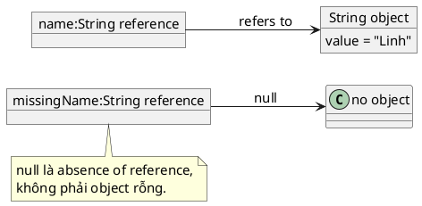

# null

## What is it

`null` là special literal trong Java dùng để nói rằng một reference hiện không trỏ tới object nào. Nó không phải object, không phải empty value, và cũng không phải default an toàn cho mọi business meaning.

`null` giúp biểu diễn thiếu dữ liệu, chưa khởi tạo, hoặc không tìm thấy kết quả. Đổi lại, nó mang theo risk lớn nhất là `NullPointerException` và cả sự mơ hồ nếu contract không rõ.

## How I used to misunderstand it

Mình từng coi `null`, empty string, empty list, và số `0` là cùng một ý nghĩa “không có gì”. Cách nghĩ đó làm code lẫn lộn giữa trạng thái dữ liệu thiếu, dữ liệu rỗng hợp lệ, và giá trị mặc định.

Bug khó chịu nhất không phải lúc code nổ ngay. Khó nhất là lúc một layer hiểu `null` là “chưa gửi”, layer khác hiểu là “không có kết quả”, và layer thứ ba hiểu là “cứ dùng default”.

## How it actually works

`null` chỉ áp dụng cho reference type. Primitive như `int` hay `boolean` không thể nhận `null`. Nếu gọi method, truy cập field, hoặc unbox một reference đang là `null`, Java sẽ ném `NullPointerException`.



Điều khó của `null` không nằm ở syntax mà ở semantics. Khi thấy `String nickname = null;`, ta phải tự hỏi: đây là chưa gửi dữ liệu, chưa load dữ liệu, hay kết quả không tồn tại? Nếu ý nghĩa không rõ, bug dễ lan sang nhiều tầng.

Null handling tốt thường bắt đầu bằng contract rõ ràng:

* tham số nào chấp nhận `null`
* method nào có thể trả `null`
* khi nào nên trả empty collection hoặc sentinel khác thay vì `null`

### Comparison table

| Giá trị | Nghĩa thường gặp | Có phải `null` không |
|---|---|---|
| `null` | Không có object nào được tham chiếu | Có |
| `""` | Có object `String`, nhưng rỗng | Không |
| `Collections.emptyList()` | Có object collection, nhưng không có phần tử | Không |
| `0` | Một số hợp lệ | Không |

### Tiny decision scaffold

```text
Missing object?                  -> maybe null
Empty but valid collection/text? -> prefer empty value
Need caller to know something is absent? -> choose a clear contract first
```

## Code example

```java
String name = null;

if (name == null) {
    name = "anonymous";
}

System.out.println(name.toUpperCase()); // ANONYMOUS
```

Ví dụ này cho thấy điều quan trọng là kiểm tra hoặc chuẩn hóa `null` trước khi dùng reference đó.

## When to use / when NOT to use

Dùng `null` khi:

* API hiện tại thật sự dùng `null` để biểu diễn thiếu dữ liệu
* bạn đang tương tác với framework, database, hoặc legacy code đã có null semantics rõ ràng

Không trả `null` chỉ vì lười quyết định contract. Nếu empty list, empty map, hoặc default object diễn đạt đúng hơn, chúng thường làm code caller đơn giản và an toàn hơn.

Không để nhiều tầng tự suy đoán ý nghĩa của `null`. Hãy chuẩn hóa càng gần boundary càng tốt.

Không nhầm `null` với “rỗng” nếu business rule thật sự phân biệt hai trạng thái này.

## How this connects to real Java projects

Trong Spring, `null` xuất hiện ở request field không gửi lên, value đọc từ database, bean optional dependency, cache miss, hoặc config không tồn tại. Nếu không chuẩn hóa sớm ở controller, mapper, hoặc service boundary, null checks sẽ rải khắp codebase.

Một practice hay là convert `null` sang contract rõ hơn ngay khi vào hệ thống, ví dụ empty collection, default value, `Optional`, hoặc exception có message rõ ràng, tùy đúng semantics.

## Gotchas

* `null` khác empty string, empty list, và `0`. Gộp chúng lại dễ làm sai business rule.
* Autounboxing từ wrapper `null` cũng là một dạng `NullPointerException`.
* `Objects.equals(a, b)` thường an toàn hơn `a.equals(b)` khi `a` có thể là `null`.
* Một field có thể không `null` ở layer này nhưng lại `null` ở boundary khác như HTTP hoặc database.

## Handbook rule

- Mặc định trả empty collection hoặc default object thay vì `null`; chỉ dùng `null` khi contract bắt buộc.
- Phân biệt rõ `null`, empty, và `0`; không gộp chúng trong cùng business rule.
- Validate/normalize null ở boundary (HTTP, DB, queue) sớm nhất có thể.
- Dùng `Objects.equals(a, b)` khi một bên có thể null; tránh `a.equals(b)` không kiểm tra.
- Wrapper unbox phải kiểm tra null trước; autoboxing không tạo cảm giác an toàn giả.

## Check yourself

* Vì sao `null` và `""` không nên bị xem là cùng nghĩa?
* Khi nào trả empty collection rõ hơn trả `null`?
* Vì sao bug `null` thường là bug contract, không chỉ là bug syntax?
* `Objects.equals(a, b)` an toàn hơn `a.equals(b)` ở điểm nào?
* Nếu DTO nhận dữ liệu từ request, bạn nên chuẩn hóa `null` sớm ở đâu?

## Exercises

### Exercise 1: Count Null Or Blank

Độ khó: Dễ

Đề bài:
Cho `String[] values`. Hãy đếm số phần tử là `null`, string rỗng `""`, hoặc chỉ chứa khoảng trắng.

Ví dụ 1:

Đầu vào:
```text
values = ["java", null, "   ", "", "spring"]
```

Đầu ra:
```text
3
```

Giải thích:
Ba phần tử không chứa nội dung text có ích là `null`, `"   "`, và `""`.

Ràng buộc:

* `0 <= values.length <= 100000`
* Mỗi phần tử là `null` hoặc một `String`
* Chỉ cần trả số lượng, không sửa mảng đầu vào

### Bài 2: First Non Null Value

Độ khó: Trung bình

Đề bài:
Cho `String[] values` và `String fallback`. Hãy trả về phần tử đầu tiên khác `null`. Nếu mọi phần tử đều là `null`, trả về `fallback`.

Ví dụ 1:

Đầu vào:
```text
values = [null, null, "boot", "data"]
fallback = "default"
```

Đầu ra:
```text
"boot"
```

Giải thích:
`"boot"` là phần tử khác `null` đầu tiên nên phải được trả về ngay.

Ràng buộc:

* `0 <= values.length <= 100000`
* `fallback` không phải `null`
* Các phần tử trong `values` có thể là `null`

### Bài 3: Compact Nullable Integers

Độ khó: Trung bình

Đề bài:
Cho `Integer[] values`. Hãy trả về một `int[]` mới chỉ chứa các phần tử không phải `null`, giữ nguyên thứ tự ban đầu.

Ví dụ 1:

Đầu vào:
```text
values = [1, null, 2, null, 3]
```

Đầu ra:
```text
[1, 2, 3]
```

Giải thích:
Các phần tử `null` bị bỏ qua, các value còn lại được unbox và giữ nguyên thứ tự.

Ràng buộc:

* `0 <= values.length <= 100000`
* Mỗi phần tử là `null` hoặc một `Integer`
* Kết quả phải là mảng primitive mới

## Links

* [[001-Primitive-vs-Wrapper]]
* [[002-String-immutable-and-pool]]
* [[../Functional/004-Optional]]
* [Java SE 21, `Objects` Javadoc](https://docs.oracle.com/en/java/javase/21/docs/api/java.base/java/util/Objects.html)
* [Java SE 21, `NullPointerException` Javadoc](https://docs.oracle.com/en/java/javase/21/docs/api/java.base/java/lang/NullPointerException.html)
* [Spring Framework Reference, `@Autowired` and Optional Dependencies](https://docs.spring.io/spring-framework/reference/core/beans/annotation-config/autowired.html)


